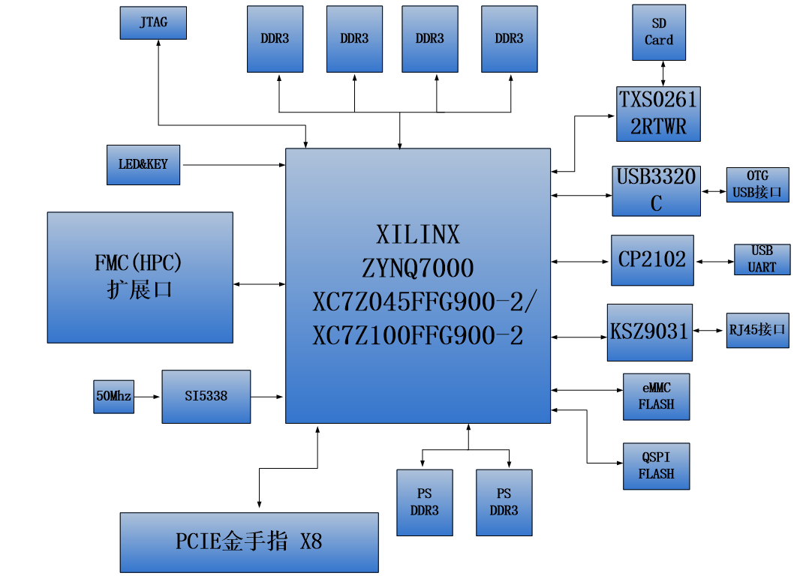
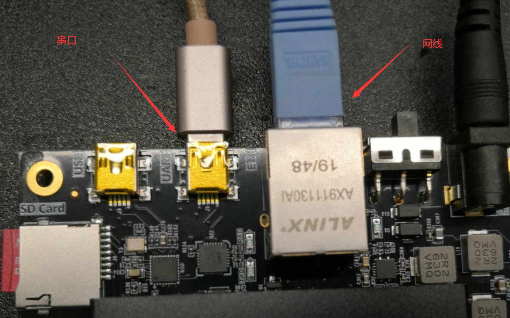
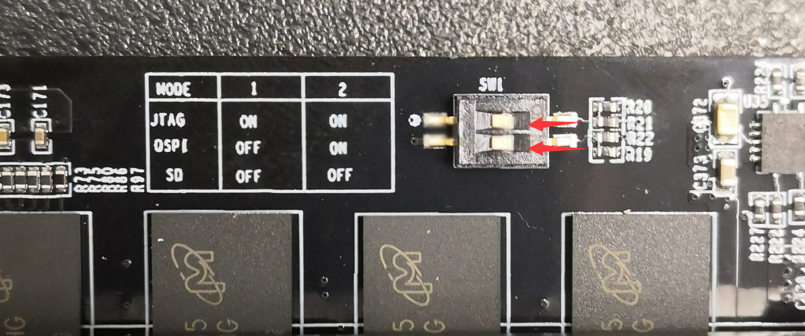
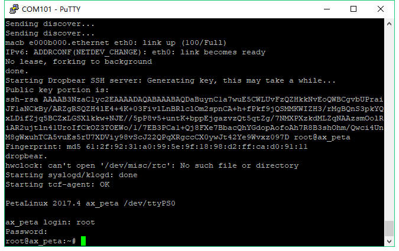
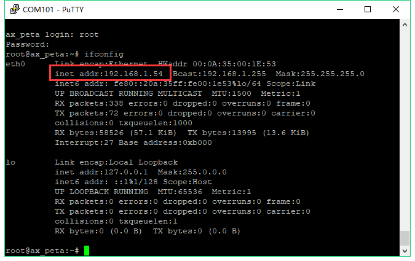
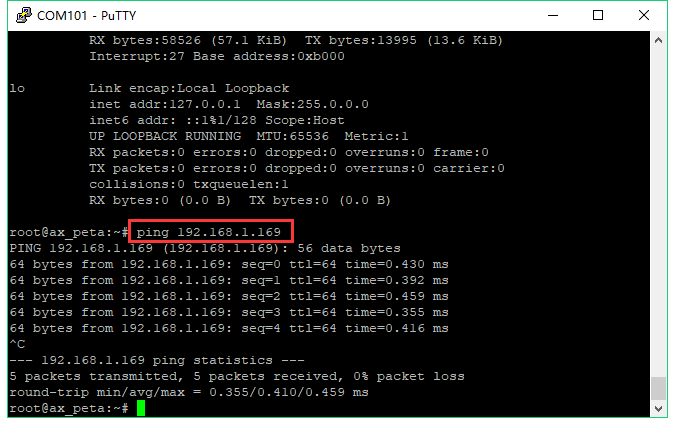

开发板简介和检测
=============================

开发板简介
----------

在这里，对这款AX7450 ZYNQ开发平台进行简单的功能介绍。

开发板主要由ZYNQ7100主芯片，6片DDR3，1片eMMC，2个QSPI
FLASH和一些外设接口组成。ZYNQ7100采用Xilinx公司的Zynq7000系列的芯片，型号为XC7Z100-2FFG900。ZYNQ710芯片可分成处理器系统部分Processor
System（PS）和可编程逻辑部分Programmable
Logic（PL）。在ZYNQ7100芯片的PS端挂了2片DDR3，PL端挂了4片DDR3，每片DDR3容量高达512M字节，使得ARM系统和FPGA系统能独立处理和存储的数据的功能。PS端的8GB
eMMC FLASH存储芯片和2片256Mb的QSPI
FLASH用来静态存储ZYNQ的操作系统、文件系统及用户数据。

AX7450开发板扩展了丰富的外围接口，其中包含1个PCIex8接口、1路千兆以太网接口、1路USB2.0
OTG接口、1路UART串口接口、1路SD卡接口、1个FMC
HPC扩展接口，2路SMA接口，和一些按键LED。

下图为整个开发系统的结构示意图：

通过这个示意图，我们可以看到，我们这个开发平台所能含有的接口和功能。

-  Xilinx ARM+FPGA芯片Zynq-7000 XC7Z100-2FFG900。

-  DDR3

带有6片大容量的512M字节（共3GB）高速DDR3
SDRAM。其中2片挂载在PS端，组成32位的数据宽度，可作为ZYNQ芯片数据的缓存，也可以作为操作系统运行的内存;
另外4片挂在PL端，组成64位数据宽度，可作为FPGA的数据存储，图像分析缓存，数据处理。

-  eMMC

PS端挂载一片8GB eMMC
FLASH存储芯片，用户存储操作系统文件或者其他用户数据。

-  QSPI FLASH

2片256Mbit的QSPI FLASH存储芯片,
可用作ZYNQ芯片的Uboot文件，系统文件和用户数据的存储;

-  PCIe接口

支持PCI Express 2.0标准，提供标准的PCIe
x8高速数据传输接口，单通道通信速率可高达5GBaud。

-  千兆以太网接口

1路10/100M/1000M以太网RJ45接口，用于和电脑或其它网络设备进行以太网数据交换。网络接口芯片采用Micrel公司的KSZ9031工业级GPHY芯片，以太网连接到ZYNQ芯片的PS端。

-  USB2.0接口

用于和PC或USB设备的OTG通信, 连接器采用MINI USB接口。

-  USB Uart接口

1路Uart转USB接口，用于和电脑通信，方便用户调试。USB接口采用MINI
USB接口。

-  Micro SD卡座

1路Micro SD卡座，用于存储操作系统镜像和文件系统。

-  FMC HPC扩展口

1个标准的FMC
HPC的扩展口，可以外接XILINX或者我们黑金的各种FMC模块（HDMI输入输出模块，双目摄像头模块，高速AD模块等等）。FMC扩展口包含84对差分IO信号和8路高速GTX收发信号。

-  JTAG口

1个USB JTAG口，通过下载器对ZYNQ系统进行调试和下载

-  SMA口

2路SMA接口，用户可以连接外部触发信号或者时钟信号。

-  时钟

板载一个33.333Mhz的有源晶振，给PS系统提供稳定的时钟源，一个50MHz的有源晶振，为PL逻辑提供额外的时钟；另外板上有一个可编程的时钟芯片给GTX提供时钟源，为PCIE，光纤和DDR工作提供参考时钟。

-  LED灯

1个电源指示灯，1个DONE指示灯，4个用户调试LED灯, 1个前面板双色LED灯。

-  按键

2个按键，1个复位按键，1个PL用户按键。

开发板检测
----------

拿到开发板，大部分人都想立即体验一下，看看开发板是否正常工作，下面我们介绍如何对开发板进行一个简单的检测。

检测需要自备的工具
~~~~~~~~~~~~~~~~~~

1) 电脑

.. image:: images/01_media/image2.png
    
2) 路由器，为了测试网络，最好能连接互联网，支持DHCP。

.. image:: images/01_media/image3.png
    
3) 网线

.. image:: images/01_media/image4.png
    
开发板线缆连接
~~~~~~~~~~~~~~

1) 连接usb转串口，主要用于看ARM打印出的一些信息，连接ARM端网口到路由器

    
2) 连接电源

开始测试
~~~~~~~~

1) 测试前我们需要安装USB转串口的驱动软件（软件/CP210x_Windows_Drivers.zip），不然无法做串口通信测试，双击exe文件进行驱动安装。驱动安装好以后，用红色USB线连接电脑USB口和开发板上的UART口进行连接,
   然后打开电脑的设备管理器，设备管理器能够找到串口设备CP210x,
   我机器上映射的是COM3。如果不能成功安装驱动，可以尝试使用驱动精灵安装。

.. image:: images/01_media/image6.png
    
.. image:: images/01_media/image7.png
    
.. image:: images/01_media/image8.png
    
2) 终端工具有很多，例如putty，teraterm,
   Windows自带终端工具，SecureCRT等等，众多终端工具中，比较下来，还是putty最好用，资料（软件/
   putty.exe）为大家准备了绿色免安装的putty软件。

3) 选择Serial，Serial
   line填写COM3，Speed填写115200，COM3串口号根据设备管理器里显示的填写

.. image:: images/01_media/image9.png
    
选择Serial，并将流控Flow control改为None，点击“Open”

.. image:: images/01_media/image10.png
    
.. image:: images/01_media/image11.png
    
启动后界面

4) 确定开发板启动模式是否为SD启动模式（默认出厂时开发板的SD卡插槽里有卡，启动模式默认也是SD卡），拨动拨码开关时用一个带尖端的工具，例如，镊子，取卡针等，轻轻拨动。

    
5) 打开开发板上的电源开关，PuTTY工具窗口会显示u-boot和Linux系统的启动信息。

.. image:: images/01_media/image13.png
    
6) 可以在串口终端登陆系统，用户: root，密码: root

    
7) 可以利用ifconfig命令查看网络状态，192.168.1.54即为路由器分配给开发板的IP地址

    
8) Ping网络中其他设备的IP地址，输入ctrl+c即可结束ping

    
9) 开发板的简单检测到此结束。

为了您方便找到教程中所用到的软件、源码包、驱动等，下面会介绍一下软件包里主要内容，教程中难免有疏漏之处，找不到时麻烦您搜索一下您的电脑。

软件包说明
----------

.. image:: images/01_media/image17.png
    
1) CP210x_Windows_Drivers.zip 串口驱动

2) **Xilinx_Unified_2023.1_0507_1903.tar.gz** Vivado
   2023.1安装包，Windows和Linux通用版本，Windows下需要WinRAR解压软件。

3) petalinux-v2023.1-final-installer.run petalinux安装包

4) qt-opensource-windows-x86-mingw530-5.7.1.exe Windows版本QT

5) qt-opensource-linux-x64-5.7.1.run Linux版本QT

6) imageUSB.exe 镜像恢复工具

7) 00_resource内包含Linux源代码、根文件系统

8) VMware-workstation-full-12.1.1-3770994.exe 虚拟机安装包

ubuntu-16.04.3-desktop-amd64.iso
Ubuntu安装包，只能装在PC上，不能装开发板
  
