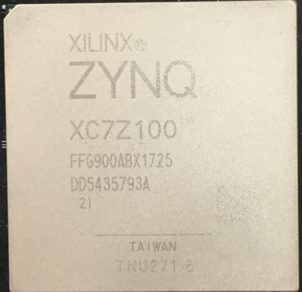

 芯驿电子科技（上海）有限公司 基于XILINX
ZYNQ7000开发平台的开发板（型号：AX7450B）2020款正式发布了正式发布了，为了让您对此开发平台可以快速了解，我们编写了此用户手册。

这款ZYNQ7000 FPGA开发平台使用XILINX的Zynq7000 SOC
芯片XC7Z100的解决方案，它采用ARM+FPGA SOC技术将双核ARM Cortex-A9 和FPGA
可编程逻辑集成在一颗芯片上。ZYNQ的PS端挂载了2片512MB的高速DDR3
SDRAM芯片, PL端挂载了4片512MB的高速DDR3
SDRAM芯片。另外PS端有1片8GB的eMMC存储芯片和2片256Mb的QSPI FLASH芯片。

外围电路方面我们为用户扩展了丰富的接口，比如1个PCIex8
接口、1路千兆以太网接口、1路USB2.0
OTG接口、1路HDMI输出接口、1路UART串口接口、1路SD卡接口、一个FMC
HPC扩展接口、2路SMA接口等等。满足用户各种高速数据交换，数据存储，视频传输处理以及工业控制的要求，是一款"专业级“的ZYNQ开发平台。为高速数据传输和交换，数据处理的前期验证和后期应用提供了可能。相信这样的一款产品非常适合从事ZYNQ开发的学生、工程师等群体。

    
开发板简介
==========

在这里，对这款AX7450B ZYNQ开发平台进行简单的功能介绍。

开发板主要由ZYNQ7100主芯片，6片DDR3，1片eMMC，2个QSPI
FLASH和一些外设接口组成。ZYNQ7100采用Xilinx公司的Zynq7000系列的芯片，型号为XC7Z100-2FFG900。ZYNQ710芯片可分成处理器系统部分Processor
System（PS）和可编程逻辑部分Programmable
Logic（PL）。在ZYNQ7100芯片的PS端挂了2片DDR3，PL端挂了4片DDR3，每片DDR3容量高达512M字节，使得ARM系统和FPGA系统能独立处理和存储的数据的功能。PS端的8GB
eMMC FLASH存储芯片和2片256Mb的QSPI
FLASH用来静态存储ZYNQ的操作系统、文件系统及用户数据。

AX7450B开发板扩展了丰富的外围接口，其中包含1个PCIex8接口、1路千兆以太网接口、1路USB2.0
OTG接口、1路UART串口接口、1路SD卡接口、1个FMC
HPC扩展接口，2路SMA接口，和一些按键LED。

下图为整个开发系统的结构示意图：

.. image:: images/media/image3.png

通过这个示意图，我们可以看到，我们这个开发平台所能含有的接口和功能。

-  Xilinx ARM+FPGA芯片Zynq-7000 XC7Z100-2FFG900。

-  DDR3

带有6片大容量的512M字节（共3GB）高速DDR3
SDRAM。其中2片挂载在PS端，组成32位的数据宽度，可作为ZYNQ芯片数据的缓存，也可以作为操作系统运行的内存;
另外4片挂在PL端，组成64位数据宽度，可作为FPGA的数据存储，图像分析缓存，数据处理。

-  eMMC

PS端挂载一片8GB eMMC
FLASH存储芯片，用户存储操作系统文件或者其他用户数据。

-  QSPI FLASH

2片256Mbit的QSPI FLASH存储芯片,
可用作ZYNQ芯片的Uboot文件，系统文件和用户数据的存储;

-  PCIe接口

支持PCI Express 2.0标准，提供标准的PCIe
x8高速数据传输接口，单通道通信速率可高达5GBaud。

-  千兆以太网接口

1路10/100M/1000M以太网RJ45接口，用于和电脑或其它网络设备进行以太网数据交换。网络接口芯片采用景略半导体的JL2121工业级GPHY芯片，以太网连接到ZYNQ芯片的PS端。

-  USB2.0接口

用于和PC或USB设备的OTG通信, 连接器采用MINI USB接口。

-  USB Uart接口

1路Uart转USB接口，用于和电脑通信，方便用户调试。USB接口采用MINI
USB接口。

-  Micro SD卡座

1路Micro SD卡座，用于存储操作系统镜像和文件系统。

-  FMC HPC扩展口

1个标准的FMC
HPC的扩展口，可以外接XILINX或者我们黑金的各种FMC模块（HDMI输入输出模块，双目摄像头模块，高速AD模块等等）。FMC扩展口包含84对差分IO信号和8路高速GTX收发信号。

-  JTAG口

1个USB JTAG口，通过下载器对ZYNQ系统进行调试和下载

-  SMA口

2路SMA接口，用户可以连接外部触发信号或者时钟信号。

-  时钟

板载一个33.333Mhz的有源晶振，给PS系统提供稳定的时钟源，一个50MHz的有源晶振，为PL逻辑提供额外的时钟；另外板上有一个可编程的时钟芯片给GTX提供时钟源，为PCIE，光纤和DDR工作提供参考时钟。

-  LED灯

1个电源指示灯，1个DONE指示灯，4个用户调试LED灯, 1个前面板双色LED灯。

-  按键

2个按键，1个复位按键，1个PL用户按键。

ZYNQ芯片
========

开发板使用的是Xilinx公司的Zynq7000系列的芯片，型号为XC7Z100-2FFG900。芯片的PS系统集成了两个ARM
Cortex™-A9处理器，AMBA®互连，内部存储器，外部存储器接口和外设。这些外设主要包括USB总线接口，以太网接口，SD/SDIO接口，I2C总线接口，CAN总线接口，UART接口，GPIO等。PS可以独立运行并在上电或复位下启动。ZYNQ7000芯片的总体框图如图2-1所示

.. image:: images/media/image4.png
    
图2-1 ZYNQ7000芯片的总体框图

其中PS系统部分的主要参数如下：

-  基于ARM 双核CortexA9 的应用处理器，ARM-v7架构 高达800MHz

-  每个CPU 32KB 1级指令和数据缓存，512KB 2级缓存 2个CPU共享

-  片上boot ROM和256KB 片内RAM

-  外部存储接口，支持16/32 bit DDR2、DDR3接口

-  两个千兆网卡支持：发散-聚集DMA ，GMII，RGMII，SGMII接口

-  两个USB2.0 OTG接口，每个最多支持12节点

-  两个CAN2.0B总线接口

-  两个SD卡、SDIO、MMC兼容控制器

-  2个SPI，2个UARTs，2个I2C接口

-  54个多功能配置的IO，可以软件配置成普通IO或者外设控制接口

-  PS内和PS到PL的高带宽连接

其中PL逻辑部分的主要参数如下：

-  逻辑单元Logic Cells：444K；

-  查找表LUTs: 277400

-  触发器(flip-flops):554,800

-  乘法器18x25MACCs：2020;

-  Block RAM：26.5Mb；

-  16路高速GTX收发器，支持PCIE Gen2x8；

-  2个AD转换器,可以测量片上电压、温度感应和高达17外部差分输入通道，1MBPS

XC7Z100-2FFG900I芯片的速度等级为-2，工业级，封装为FGG900，引脚间距为1.0mm，ZYNQ7000系列的具体的芯片型号定义如下图2-2所示。

.. image:: images/media/image5.png
    
图2-2 ZYNQ型号命名规则定义

图2-3为开发板所用的XC7Z100芯片实物图。

。

    
图2-3 XC7Z100芯片实物

DDR3 DRAM
=========

AX7450B开发板上配有6片Micron(美光）的512MB的DDR3芯片,型号为MT41J256M16HA-125(兼容MT41K256M16HA-125)。其中PS挂载2片，组成32位的数据宽度，PL端挂载4片，组成64位的数据宽度。PS端的DDR3
SDRAM的最高运行速度可达533MHz(数据速率1066Mbps)，2片DDR3存储系统直接连接到了ZYNQ处理系统（PS）的BANK
502的存储器接口上。PL端的DDR3
SDRAM的最高运行速度可达800MHz(数据速率1600Mbps)，4片DDR3存储系统连接到了FPGA的BANK33,
BANK34的接口上。DDR3 SDRAM的具体配置如下表3-1所示。

表3-1 DDR3 SDRAM配置

+--------------+---------------------+------------------+--------------+
| **位号**     | **芯片型号**        | **容量**         | **厂家**     |
+--------------+---------------------+------------------+--------------+
| U5,U6,U8,U9  | MT41J256M16HA-125   | 256M x 16bit     | Micron       |
|              |                     |                  |              |
| U11,U12      |                     |                  |              |
+--------------+---------------------+------------------+--------------+

DDR3的硬件设计需要严格考虑信号完整性，我们在电路设计和PCB设计的时候已经充分考虑了匹配电阻/终端电阻,走线阻抗控制，走线等长控制，　保证DDR3的高速稳定的工作。

PS端的DDR3 DRAM的硬件连接方式如图3-1所示:

.. image:: images/media/image7.png

图3-1 DDR3 DRAM原理图部分

PL端的DDR3 DRAM的硬件连接方式如图3-2所示:

.. image:: images/media/image8.png

**PS端DDR3 DRAM引脚分配：**

+------------------------+----------------------------+----------------+
| **信号名称**           | **ZYNQ引脚名**             | **ZYNQ引脚号** |
+------------------------+----------------------------+----------------+
| **PS_DDR3_DQS0_P**     | PS_DDR_DQS_P0_502          | C26            |
+------------------------+----------------------------+----------------+
| **PS_DDR3_DQS0_N**     | PS_DDR_DQS_N0_502          | B26            |
+------------------------+----------------------------+----------------+
| **PS_DDR3_DQS1_P**     | PS_DDR_DQS_P1_502          | C29            |
+------------------------+----------------------------+----------------+
| **PS_DDR3_DQS1_N**     | PS_DDR_DQS_N1_502          | B29            |
+------------------------+----------------------------+----------------+
| **PS_DDR3_DQS2_P**     | PS_DDR_DQS_P2_502          | G29            |
+------------------------+----------------------------+----------------+
| **PS_DDR3_DQS2_N**     | PS_DDR_DQS_N2_502          | F29            |
+------------------------+----------------------------+----------------+
| **PS_DDR3_DQS3_P**     | PS_DDR_DQS_P3_502          | L28            |
+------------------------+----------------------------+----------------+
| **PS_DDR3_DQS4_N**     | PS_DDR_DQS_N3_502          | L29            |
+------------------------+----------------------------+----------------+
| **PS_DDR3_D0**         | PS_DDR_DQ0_502             | A25            |
+------------------------+----------------------------+----------------+
| **PS_DDR3_D1**         | PS_DDR_DQ1_502             | E25            |
+------------------------+----------------------------+----------------+
| **PS_DDR3_D2**         | PS_DDR_DQ2_502             | B27            |
+------------------------+----------------------------+----------------+
| **PS_DDR3_D3**         | PS_DDR_DQ3_502             | D25            |
+------------------------+----------------------------+----------------+
| **PS_DDR3_D4**         | PS_DDR_DQ4_502             | B25            |
+------------------------+----------------------------+----------------+
| **PS_DDR3_D5**         | PS_DDR_DQ5_502             | E26            |
+------------------------+----------------------------+----------------+
| **PS_DDR3_D6**         | PS_DDR_DQ6_502             | D26            |
+------------------------+----------------------------+----------------+
| **PS_DDR3_D7**         | PS_DDR_DQ7_502             | E27            |
+------------------------+----------------------------+----------------+
| **PS_DDR3_D8**         | PS_DDR_DQ8_502             | A29            |
+------------------------+----------------------------+----------------+
| **PS_DDR3_D9**         | PS_DDR_DQ9_502             | A27            |
+------------------------+----------------------------+----------------+
| **PS_DDR3_D10**        | PS_DDR_DQ10_502            | A30            |
+------------------------+----------------------------+----------------+
| **PS_DDR3_D11**        | PS_DDR_DQ11_502            | A28            |
+------------------------+----------------------------+----------------+
| **PS_DDR3_D12**        | PS_DDR_DQ12_502            | C28            |
+------------------------+----------------------------+----------------+
| **PS_DDR3_D13**        | PS_DDR_DQ13_502            | D30            |
+------------------------+----------------------------+----------------+
| **PS_DDR3_D14**        | PS_DDR_DQ14_502            | D28            |
+------------------------+----------------------------+----------------+
| **PS_DDR3_D15**        | PS_DDR_DQ15_502            | D29            |
+------------------------+----------------------------+----------------+
| **PS_DDR3_D16**        | PS_DDR_DQ16_502            | H27            |
+------------------------+----------------------------+----------------+
| **PS_DDR3_D17**        | PS_DDR_DQ17_502            | G27            |
+------------------------+----------------------------+----------------+
| **PS_DDR3_D18**        | PS_DDR_DQ18_502            | H28            |
+------------------------+----------------------------+----------------+
| **PS_DDR3_D19**        | PS_DDR_DQ19_502            | E28            |
+------------------------+----------------------------+----------------+
| **PS_DDR3_D20**        | PS_DDR_DQ20_502            | E30            |
+------------------------+----------------------------+----------------+
| **PS_DDR3_D21**        | PS_DDR_DQ21_502            | F28            |
+------------------------+----------------------------+----------------+
| **PS_DDR3_D22**        | PS_DDR_DQ22_502            | G30            |
+------------------------+----------------------------+----------------+
| **PS_DDR3_D23**        | PS_DDR_DQ23_502            | F30            |
+------------------------+----------------------------+----------------+
| **PS_DDR3_D24**        | PS_DDR_DQ24_502            | J29            |
+------------------------+----------------------------+----------------+
| **PS_DDR3_D25**        | PS_DDR_DQ25_502            | K27            |
+------------------------+----------------------------+----------------+
| **PS_DDR3_D26**        | PS_DDR_DQ26_502            | J30            |
+------------------------+----------------------------+----------------+
| **PS_DDR3_D27**        | PS_DDR_DQ27_502            | J28            |
+------------------------+----------------------------+----------------+
| **PS_DDR3_D28**        | PS_DDR_DQ28_502            | K30            |
+------------------------+----------------------------+----------------+
| **PS_DDR3_D29**        | PS_DDR_DQ29_502            | M29            |
+------------------------+----------------------------+----------------+
| **PS_DDR3_D30**        | PS_DDR_DQ30_502            | L30            |
+------------------------+----------------------------+----------------+
| **PS_DDR3_D31**        | PS_DDR_DQ31_502            | M30            |
+------------------------+----------------------------+----------------+
| **PS_DDR3_DM0**        | PS_DDR_DM0_502             | C27            |
+------------------------+----------------------------+----------------+
| **PS_DDR3_DM1**        | PS_DDR_DM1_502             | B30            |
+------------------------+----------------------------+----------------+
| **PS_DDR3_DM2**        | PS_DDR_DM2_502             | H29            |
+------------------------+----------------------------+----------------+
| **PS_DDR3_DM3**        | PS_DDR_DM3_502             | K28            |
+------------------------+----------------------------+----------------+
| **PS_DDR3_A0**         | PS_DDR_A0_502              | L25            |
+------------------------+----------------------------+----------------+
| **PS_DDR3_A1**         | PS_DDR_A1_502              | K26            |
+------------------------+----------------------------+----------------+
| **PS_DDR3_A2**         | PS_DDR_A2_502              | L27            |
+------------------------+----------------------------+----------------+
| **PS_DDR3_A3**         | PS_DDR_A3_502              | G25            |
+------------------------+----------------------------+----------------+
| **PS_DDR3_A4**         | PS_DDR_A4_502              | J26            |
+------------------------+----------------------------+----------------+
| **PS_DDR3_A5**         | PS_DDR_A5_502              | G24            |
+------------------------+----------------------------+----------------+
| **PS_DDR3_A6**         | PS_DDR_A6_502              | H26            |
+------------------------+----------------------------+----------------+
| **PS_DDR3_A7**         | PS_DDR_A7_502              | K22            |
+------------------------+----------------------------+----------------+
| **PS_DDR3_A8**         | PS_DDR_A8_502              | F27            |
+------------------------+----------------------------+----------------+
| **PS_DDR3_A9**         | PS_DDR_A9_502              | J23            |
+------------------------+----------------------------+----------------+
| **PS_DDR3_A10**        | PS_DDR_A10_502             | G26            |
+------------------------+----------------------------+----------------+
| **PS_DDR3_A11**        | PS_DDR_A11_502             | H24            |
+------------------------+----------------------------+----------------+
| **PS_DDR3_A12**        | PS_DDR_A12_502             | K23            |
+------------------------+----------------------------+----------------+
| **PS_DDR3_A13**        | PS_DDR_A13_502             | H23            |
+------------------------+----------------------------+----------------+
| **PS_DDR3_A14**        | PS_DDR_A14_502             | J24            |
+------------------------+----------------------------+----------------+
| **PS_DDR3_BA0**        | PS_DDR_BA0_502             | M27            |
+------------------------+----------------------------+----------------+
| **PS_DDR3_BA1**        | PS_DDR_BA1_502             | M26            |
+------------------------+----------------------------+----------------+
| **PS_DDR3_BA2**        | PS_DDR_BA2_502             | M25            |
+------------------------+----------------------------+----------------+
| **PS_DDR3_S0**         | PS_DDR_CS_B_502            | N22            |
+------------------------+----------------------------+----------------+
| **PS_DDR3_RAS**        | PS_DDR_RAS_B_502           | N24            |
+------------------------+----------------------------+----------------+
| **PS_DDR3_CAS**        | PS_DDR_CAS_B_502           | M24            |
+------------------------+----------------------------+----------------+
| **PS_DDR3_WE**         | PS_DDR_WE_B_502            | N23            |
+------------------------+----------------------------+----------------+
| **PS_DDR3_ODT**        | PS_DDR_ODT_502             | L23            |
+------------------------+----------------------------+----------------+
| **PS_DDR3_RESET**      | PS_DDR_DRST_B_502          | F25            |
+------------------------+----------------------------+----------------+
| **PS_DDR3_CLK0_P**     | PS_DDR_CKP_502             | K25            |
+------------------------+----------------------------+----------------+
| **PS_DDR3_CLK0_N**     | PS_DDR_CKN_502             | J25            |
+------------------------+----------------------------+----------------+
| **PS_DDR3_CKE**        | PS_DDR_CKE_502             | M22            |
+------------------------+----------------------------+----------------+

**PL端DDR3 DRAM引脚分配：**

+-----------------------+----------------------------+----------------+
| **信号名称**          | **ZYNQ引脚名**             | **ZYNQ引脚号** |
+-----------------------+----------------------------+----------------+
| PL_DDR3_DM0           | IO_L4P_T0_35               | J14            |
+-----------------------+----------------------------+----------------+
| PL_DDR3_DQS0_N        | IO_L3N_T0_DQS_AD1N_35      | K13            |
+-----------------------+----------------------------+----------------+
| PL_DDR3_DQS0_P        | IO_L3P_T0_DQS_AD1P_35      | L13            |
+-----------------------+----------------------------+----------------+
| PL_DDR3_D0            | IO_L5N_T0_AD9N_35          | J15            |
+-----------------------+----------------------------+----------------+
| PL_DDR3_D1            | IO_L2N_T0_AD8N_35          | H13            |
+-----------------------+----------------------------+----------------+
| PL_DDR3_D2            | IO_L1P_T0_AD0P_35          | L15            |
+-----------------------+----------------------------+----------------+
| PL_DDR3_D3            | IO_L2P_T0_AD8P_35          | J13            |
+-----------------------+----------------------------+----------------+
| PL_DDR3_D4            | IO_L5P_T0_AD9P_35          | K15            |
+-----------------------+----------------------------+----------------+
| PL_DDR3_D5            | IO_L1N_T0_AD0N_35          | L14            |
+-----------------------+----------------------------+----------------+
| PL_DDR3_D6            | IO_L6P_T0_35               | J16            |
+-----------------------+----------------------------+----------------+
| PL_DDR3_D7            | IO_L4N_T0_35               | H14            |
+-----------------------+----------------------------+----------------+
| PL_DDR3_DM1           | IO_L12N_T1_MRCC_35         | F14            |
+-----------------------+----------------------------+----------------+
| PL_DDR3_DQS1_N        | IO_L9N_T1_DQS_AD3N_35      | F12            |
+-----------------------+----------------------------+----------------+
| PL_DDR3_DQS1_P        | IO_L9P_T1_DQS_AD3P_35      | G12            |
+-----------------------+----------------------------+----------------+
| PL_DDR3_D8            | IO_L8N_T1_AD10N_35         | G14            |
+-----------------------+----------------------------+----------------+
| PL_DDR3_D9            | IO_L10N_T1_AD11N_35        | E12            |
+-----------------------+----------------------------+----------------+
| PL_DDR3_D10           | IO_L7N_T1_AD2N_35          | G16            |
+-----------------------+----------------------------+----------------+
| PL_DDR3_D11           | IO_L11N_T1_SRCC_35         | D13            |
+-----------------------+----------------------------+----------------+
| PL_DDR3_D12           | IO_L10P_T1_AD11P_35        | F13            |
+-----------------------+----------------------------+----------------+
| PL_DDR3_D13           | IO_L11P_T1_SRCC_35         | E13            |
+-----------------------+----------------------------+----------------+
| PL_DDR3_D14           | IO_L8P_T1_AD10P_35         | G15            |
+-----------------------+----------------------------+----------------+
| PL_DDR3_D15           | IO_L12P_T1_MRCC_35         | F15            |
+-----------------------+----------------------------+----------------+
| PL_DDR3_DM2           | IO_L16N_T2_35              | C16            |
+-----------------------+----------------------------+----------------+
| PL_DDR3_DQS2_N        | IO_L15N_T2_DQS_AD12N_35    | E17            |
+-----------------------+----------------------------+----------------+
| PL_DDR3_DQS2_P        | IO_L15P_T2_DQS_AD12P_35    | F17            |
+-----------------------+----------------------------+----------------+
| PL_DDR3_D16           | IO_L18N_T2_AD13N_35        | A17            |
+-----------------------+----------------------------+----------------+
| PL_DDR3_D17           | IO_L16P_T2_35              | D16            |
+-----------------------+----------------------------+----------------+
| PL_DDR3_D18           | IO_L17P_T2_AD5P_35         | C17            |
+-----------------------+----------------------------+----------------+
| PL_DDR3_D19           | IO_L14P_T2_AD4P_SRCC_35    | D15            |
+-----------------------+----------------------------+----------------+
| PL_DDR3_D20           | IO_L17N_T2_AD5N_35         | B16            |
+-----------------------+----------------------------+----------------+
| PL_DDR3_D21           | IO_L13N_T2_MRCC_35         | E15            |
+-----------------------+----------------------------+----------------+
| PL_DDR3_D22           | IO_L18P_T2_AD13P_35        | B17            |
+-----------------------+----------------------------+----------------+
| PL_DDR3_D23           | IO_L14N_T2_AD4N_SRCC_35    | D14            |
+-----------------------+----------------------------+----------------+
| PL_DDR3_DM3           | IO_L20P_T3_AD6P_35         | C12            |
+-----------------------+----------------------------+----------------+
| PL_DDR3_DQS3_N        | IO_L21N_T3_DQS_AD14N_35    | A15            |
+-----------------------+----------------------------+----------------+
| PL_DDR3_DQS3_P        | IO_L21P_T3_DQS_AD14P_35    | B15            |
+-----------------------+----------------------------+----------------+
| PL_DDR3_D24           | IO_L22P_T3_AD7P_35         | C11            |
+-----------------------+----------------------------+----------------+
| PL_DDR3_D25           | IO_L23P_T3_35              | B14            |
+-----------------------+----------------------------+----------------+
| PL_DDR3_D26           | IO_L22N_T3_AD7N_35         | B11            |
+-----------------------+----------------------------+----------------+
| PL_DDR3_D27           | IO_L24N_T3_AD15N_35        | A12            |
+-----------------------+----------------------------+----------------+
| PL_DDR3_D28           | IO_L24P_T3_AD15P_35        | A13            |
+-----------------------+----------------------------+----------------+
| PL_DDR3_D29           | IO_L19P_T3_35              | C14            |
+-----------------------+----------------------------+----------------+
| PL_DDR3_D30           | IO_L20N_T3_AD6N_35         | B12            |
+-----------------------+----------------------------+----------------+
| PL_DDR3_D31           | IO_L23N_T3_35              | A14            |
+-----------------------+----------------------------+----------------+
| PL_DDR3_DM4           | IO_L2P_T0_33               | L1             |
+-----------------------+----------------------------+----------------+
| PL_DDR3_DQS4_N        | IO_L3N_T0_DQS_33           | K2             |
+-----------------------+----------------------------+----------------+
| PL_DDR3_DQS4_P        | IO_L3P_T0_DQS_33           | K3             |
+-----------------------+----------------------------+----------------+
| PL_DDR3_D32           | IO_L1N_T0_33               | J3             |
+-----------------------+----------------------------+----------------+
| PL_DDR3_D33           | IO_L4N_T0_33               | L2             |
+-----------------------+----------------------------+----------------+
| PL_DDR3_D34           | IO_L1P_T0_33               | J4             |
+-----------------------+----------------------------+----------------+
| PL_DDR3_D35           | IO_L4P_T0_33               | L3             |
+-----------------------+----------------------------+----------------+
| PL_DDR3_D36           | IO_L2N_T0_33               | K1             |
+-----------------------+----------------------------+----------------+
| PL_DDR3_D37           | IO_L6P_T0_33               | K6             |
+-----------------------+----------------------------+----------------+
| PL_DDR3_D38           | IO_L5N_T0_33               | J5             |
+-----------------------+----------------------------+----------------+
| PL_DDR3_D39           | IO_L5P_T0_33               | K5             |
+-----------------------+----------------------------+----------------+
| PL_DDR3_DM5           | IO_L12P_T1_MRCC_33         | G5             |
+-----------------------+----------------------------+----------------+
| PL_DDR3_DQS5_N        | IO_L9N_T1_DQS_33           | H1             |
+-----------------------+----------------------------+----------------+
| PL_DDR3_DQS5_P        | IO_L9P_T1_DQS_33           | J1             |
+-----------------------+----------------------------+----------------+
| PL_DDR3_D40           | IO_L11P_T1_SRCC_33         | H4             |
+-----------------------+----------------------------+----------------+
| PL_DDR3_D41           | IO_L10N_T1_33              | G1             |
+-----------------------+----------------------------+----------------+
| PL_DDR3_D42           | IO_L8P_T1_33               | H6             |
+-----------------------+----------------------------+----------------+
| PL_DDR3_D43           | IO_L7N_T1_33               | F2             |
+-----------------------+----------------------------+----------------+
| PL_DDR3_D44           | IO_L10P_T1_33              | H2             |
+-----------------------+----------------------------+----------------+
| PL_DDR3_D45           | IO_L12N_T1_MRCC_33         | G4             |
+-----------------------+----------------------------+----------------+
| PL_DDR3_D46           | IO_L8N_T1_33               | G6             |
+-----------------------+----------------------------+----------------+
| PL_DDR3_D47           | IO_L11N_T1_SRCC_33         | H3             |
+-----------------------+----------------------------+----------------+
| PL_DDR3_DM6           | IO_L14N_T2_SRCC_33         | F3             |
+-----------------------+----------------------------+----------------+
| PL_DDR3_DQS6_N        | IO_L15N_T2_DQS_33          | D5             |
+-----------------------+----------------------------+----------------+
| PL_DDR3_DQS6_P        | IO_L15P_T2_DQS_33          | E6             |
+-----------------------+----------------------------+----------------+
| PL_DDR3_D48           | IO_L18P_T2_33              | E1             |
+-----------------------+----------------------------+----------------+
| PL_DDR3_D49           | IO_L17P_T2_33              | E3             |
+-----------------------+----------------------------+----------------+
| PL_DDR3_D50           | IO_L16N_T2_33              | D3             |
+-----------------------+----------------------------+----------------+
| PL_DDR3_D51           | IO_L14P_T2_SRCC_33         | F4             |
+-----------------------+----------------------------+----------------+
| PL_DDR3_D52           | IO_L18N_T2_33              | D1             |
+-----------------------+----------------------------+----------------+
| PL_DDR3_D53           | IO_L13N_T2_MRCC_33         | E5             |
+-----------------------+----------------------------+----------------+
| PL_DDR3_D54           | IO_L16P_T2_33              | D4             |
+-----------------------+----------------------------+----------------+
| PL_DDR3_D55           | IO_L17N_T2_33              | E2             |
+-----------------------+----------------------------+----------------+
| PL_DDR3_DM7           | IO_L23N_T3_33              | B1             |
+-----------------------+----------------------------+----------------+
| PL_DDR3_DQS7_N        | IO_L21N_T3_DQS_33          | A4             |
+-----------------------+----------------------------+----------------+
| PL_DDR3_DQS7_P        | IO_L21P_T3_DQS_33          | A5             |
+-----------------------+----------------------------+----------------+
| PL_DDR3_D56           | IO_L22P_T3_33              | C2             |
+-----------------------+----------------------------+----------------+
| PL_DDR3_D57           | IO_L24N_T3_33              | A2             |
+-----------------------+----------------------------+----------------+
| PL_DDR3_D58           | IO_L20N_T3_33              | B4             |
+-----------------------+----------------------------+----------------+
| PL_DDR3_D59           | IO_L20P_T3_33              | B5             |
+-----------------------+----------------------------+----------------+
| PL_DDR3_D60           | IO_L22N_T3_33              | C1             |
+-----------------------+----------------------------+----------------+
| PL_DDR3_D61           | IO_L24P_T3_33              | A3             |
+-----------------------+----------------------------+----------------+
| PL_DDR3_D62           | IO_L19P_T3_33              | C4             |
+-----------------------+----------------------------+----------------+
| PL_DDR3_D63           | IO_L23P_T3_33              | B2             |
+-----------------------+----------------------------+----------------+
| PL_DDR3_A14           | IO_L22N_T3_34              | K10            |
+-----------------------+----------------------------+----------------+
| PL_DDR3_A13           | IO_L7P_T1_34               | J11            |
+-----------------------+----------------------------+----------------+
| PL_DDR3_A12           | IO_L13P_T2_MRCC_34         | H9             |
+-----------------------+----------------------------+----------------+
| PL_DDR3_A11           | IO_L20N_T3_34              | J9             |
+-----------------------+----------------------------+----------------+
| PL_DDR3_A10           | IO_L18N_T2_34              | G7             |
+-----------------------+----------------------------+----------------+
| PL_DDR3_A9            | IO_L9P_T1_DQS_34           | H12            |
+-----------------------+----------------------------+----------------+
| PL_DDR3_A8            | IO_L23P_T3_34              | L10            |
+-----------------------+----------------------------+----------------+
| PL_DDR3_A7            | IO_L10P_T1_34              | E10            |
+-----------------------+----------------------------+----------------+
| PL_DDR3_A6            | IO_L19P_T3_34              | L7             |
+-----------------------+----------------------------+----------------+
| PL_DDR3_A5            | IO_L8N_T1_34               | D11            |
+-----------------------+----------------------------+----------------+
| PL_DDR3_A4            | IO_L15N_T2_DQS_34          | H8             |
+-----------------------+----------------------------+----------------+
| PL_DDR3_A3            | IO_L10N_T1_34              | D10            |
+-----------------------+----------------------------+----------------+
| PL_DDR3_A2            | IO_L7N_T1_34               | H11            |
+-----------------------+----------------------------+----------------+
| PL_DDR3_A1            | IO_L21P_T3_DQS_34          | L8             |
+-----------------------+----------------------------+----------------+
| PL_DDR3_A0            | IO_L18P_T2_34              | H7             |
+-----------------------+----------------------------+----------------+
| PL_DDR3_BA2           | IO_L9N_T1_DQS_34           | G11            |
+-----------------------+----------------------------+----------------+
| PL_DDR3_BA1           | IO_L21N_T3_DQS_34          | K8             |
+-----------------------+----------------------------+----------------+
| PL_DDR3_BA0           | IO_L22P_T3_34              | K11            |
+-----------------------+----------------------------+----------------+
| PL_DDR3_CLK0_P        | IO_L12P_T1_MRCC_34         | D9             |
+-----------------------+----------------------------+----------------+
| PL_DDR3_CLK0_N        | IO_L12N_T1_MRCC_34         | D8             |
+-----------------------+----------------------------+----------------+
| PL_DDR3_RAS           | IO_L13N_T2_MRCC_34         | G9             |
+-----------------------+----------------------------+----------------+
| PL_DDR3_S0            | IO_L16P_T2_34              | F8             |
+-----------------------+----------------------------+----------------+
| PL_DDR3_WE            | IO_L16N_T2_34              | F7             |
+-----------------------+----------------------------+----------------+
| PL_DDR3_CAS           | IO_L17P_T2_34              | E7             |
+-----------------------+----------------------------+----------------+
| PL_DDR3_CKE           | IO_L17N_T2_34              | D6             |
+-----------------------+----------------------------+----------------+
| PL_DDR3_ODT           | IO_L20P_T3_34              | J10            |
+-----------------------+----------------------------+----------------+
| PL_DDR3_RESET         | IO_L8P_T1_34               | E11            |
+-----------------------+----------------------------+----------------+

QSPI Flash
==========

开发板配有2片256MBit大小的Quad-SPI
FLASH芯片，型号为W25Q256FVEI，它使用3.3V CMOS电压标准。由于QSPI
FLASH的非易失特性，在使用中，
它可以作为系统的启动设备来存储系统的启动镜像。这些镜像主要包括FPGA的bit文件、ARM的应用程序代码以及其它的用户数据文件。QSPI
FLASH的具体型号和相关参数见表4-1。

+--------------+--------------------+------------------+--------------+
| **位号**     | **芯片类型**       | **容量**         | **厂家**     |
+--------------+--------------------+------------------+--------------+
| U13，U14     | W25Q256FVEI        | 32M Byte         | Winbond      |
+--------------+--------------------+------------------+--------------+

表4-1 QSPI Flash的型号和参数

QSPI
FLASH连接到ZYNQ芯片的PS部分BANK500的GPIO口上，在系统设计中需要配置这些PS端的GPIO口功能为QSPI
FLASH接口。为图4-1为QSPI Flash在原理图中的部分。

.. image:: images/media/image9.png

图4-1 QSPI Flash连接示意图

**配置芯片引脚分配：**

+-----------------------------+------------------+---------------------+
| **信号名称**                | **ZYNQ引脚名**   | **ZYNQ引脚号**      |
+-----------------------------+------------------+---------------------+
| **QSPI0_SCK**               | PS_MIO6_500      | D24                 |
+-----------------------------+------------------+---------------------+
| **QSPI0_CS**                | PS_MIO1_500      | D23                 |
+-----------------------------+------------------+---------------------+
| **QSPI0_D0**                | PS_MIO2_500      | F23                 |
+-----------------------------+------------------+---------------------+
| **QSPI0_D1**                | PS_MIO3_500      | C23                 |
+-----------------------------+------------------+---------------------+
| **QSPI0_D2**                | PS_MIO4_500      | E23                 |
+-----------------------------+------------------+---------------------+
| **QSPI0_D3**                | PS_MIO5_500      | C24                 |
+-----------------------------+------------------+---------------------+
| **QSPI1_SCK**               | PS_MIO9_500      | A24                 |
+-----------------------------+------------------+---------------------+
| **QSPI1_CS**                | PS_MIO0_500      | F24                 |
+-----------------------------+------------------+---------------------+
| **QSPI1_D0**                | PS_MIO10_500     | E22                 |
+-----------------------------+------------------+---------------------+
| **QSPI1_D1**                | PS_MIO11_500     | A23                 |
+-----------------------------+------------------+---------------------+
| **QSPI1_D2**                | PS_MIO12_500     | E21                 |
+-----------------------------+------------------+---------------------+
| **QSPI1_D3**                | PS_MIO13_500     | F22                 |
+-----------------------------+------------------+---------------------+

eMMC Flash
==========

开发板配有一片大容量的8GB大小的eMMC
FLASH芯片，型号为THGBMFG6C1LBAIL，它支持JEDEC e-MMC
V5.0标准的HS-MMC接口，电平支持1.8V或者3.3V。eMMC
FLASH和ZYNQ连接的数据宽度为4bit。由于eMMC
FLASH的大容量和非易失特性，在ZYNQ系统使用中，它可以作为系统大容量的存储设备，比如存储ARM的应用程序、系统文件以及其它的用户数据文件。eMMC
FLASH的具体型号和相关参数见表5-1。

+--------------+--------------------+------------------+--------------+
| **位号**     | **芯片类型**       | **容量**         | **厂家**     |
+--------------+--------------------+------------------+--------------+
| U11          | THGBMFG6C1LBAIL    | 8G Byte          | TOSHIBA      |
+--------------+--------------------+------------------+--------------+

表5-1 eMMC Flash的型号和参数

eMMC
FLASH连接到ZYNQ芯片的PS部分BANK501的GPIO口上，在系统设计中需要配置这些PS端的GPIO口功能为SD接口。为图5-1为eMMC
Flash在原理图中的部分。

.. image:: images/media/image10.png

图5-1 eMMC Flash连接示意图

**配置芯片引脚分配：**

+-----------------------------+------------------+---------------------+
| **信号名称**                | **ZYNQ引脚名**   | **ZYNQ引脚号**      |
+-----------------------------+------------------+---------------------+
| **MMC_CCLK**                | PS_MIO48_501     | C19                 |
+-----------------------------+------------------+---------------------+
| **MMC_CMD**                 | PS_MIO47_501     | A18                 |
+-----------------------------+------------------+---------------------+
| **MMC_D0**                  | PS_MIO46_501     | F20                 |
+-----------------------------+------------------+---------------------+
| **MMC_D1**                  | PS_MIO49_501     | D18                 |
+-----------------------------+------------------+---------------------+
| **MMC_D2**                  | PS_MIO50_501     | A19                 |
+-----------------------------+------------------+---------------------+
| **MMC_D3**                  | PS_MIO51_501     | F19                 |
+-----------------------------+------------------+---------------------+

时钟配置
========

AX7450B开发板上分别为PS系统和PL逻辑部分提供了单端和差分有源时钟，使PS系统和PL逻辑可以单独工作。另外板为高速收发器GTX提供差分时钟源。

**PS系统时钟源**

ZYNQ芯片通过开发板上的X4晶振为PS部分提供33.333MHz的时钟输入。时钟的输入连接到ZYNQ芯片的BANK500的PS_CLK_500的管脚上。其原理图如图6-1所示：

.. image:: images/media/image11.png
    
图6-1 PS部分的有源晶振

时钟引脚分配：

+-----------------------------------+-----------------------------------+
| 信号名称                          | ZYNQ引脚                          |
+-----------------------------------+-----------------------------------+
| PS_CLK                            | A22                               |
+-----------------------------------+-----------------------------------+

**PL系统时钟源**

板上提供了一个单端50MHz的PL系统时钟源，1.8V供电。晶振输出连接到FPGA
BANK9的局部时钟(SRCC)，这个时钟可以用来驱动FPGA内的用户逻辑电路。该时钟源的原理图如图6-3所示

    
PL时钟引脚分配：

+-----------------------------------+-----------------------------------+
| 信号名称                          | ZYNQ引脚                          |
+-----------------------------------+-----------------------------------+
| PL_CLK                            | AB19                              |
+-----------------------------------+-----------------------------------+

**DDR参考时钟**

一路200Mhz的差分晶振提供给BANK34，作为PL的DDR控制器的参考时钟；
 

    
图 6-5 200Mhz时钟参考源

PL时钟引脚分配：

+-----------------------------------+-----------------------------------+
| 信号名称                          | ZYNQ引脚                          |
+-----------------------------------+-----------------------------------+
| CLK0_P                            | F9                                |
+-----------------------------------+-----------------------------------+
| CLK0_N                            | E9                                |
+-----------------------------------+-----------------------------------+

**收发器参考时钟**

一路156.25Mhz的差分晶振提供给BANK110，作为GTX收发器的SPF的参考时钟。

    
收发器参考时钟引脚分配：

+-----------------------------------+-----------------------------------+
| 信号名称                          | ZYNQ引脚                          |
+-----------------------------------+-----------------------------------+
| MGTREFCLK_P                       | AC8                               |
+-----------------------------------+-----------------------------------+
| MGTREFCLK_N                       | AC7                               |
+-----------------------------------+-----------------------------------+

USB转串口
=========

开发板上配备了一个Uart转USB接口，用于核心板单独供电和调试。转换芯片采用Silicon
Labs CP2102GM的USB-UAR芯片, USB接口采用MINI
USB接口，可以用一根USB线将它连接到上PC的USB口进行核心板的单独供电和串口数据通信
。

USB Uart电路设计的示意图如下图所示:

7-1 USB转串口示意图

**USB转串口的ZYNQ引脚分配：**

+---------------+--------------+------------+-------------------------+
| **信号名称**  | **ZY         | **ZY       | **备注**                |
|               | NQ引脚名**   | NQ引脚号** |                         |
+---------------+--------------+------------+-------------------------+
| UART_RXD      | PS_MIO14_500 | B22        | Uart数据输入            |
+---------------+--------------+------------+-------------------------+
| UART_TXD      | PS_MIO15_500 | C22        | Uart数据输出            |
+---------------+--------------+------------+-------------------------+

千兆以太网接口
==============

AX7450B开发板上有1路千兆以太网接口，以太网接口是连接的PS系统端BANK501的MIO接口上。以太网芯片采用景略半导体的工业级以太网GPHY芯片（JL2121-N040I）为用户提供网络通信服务。JL2121芯片支持10/100/1000
Mbps网络传输速率，通过RGMII接口跟Zynq7000系统的MAC层进行数据通信。JL2121支持ＭDI/MDX自适应，各种速度自适应，Master/Slave自适应，支持MDIO总线进行PHY的寄存器管理。

JL2121上电会检测一些特定的IO的电平状态，从而确定自己的工作模式。表8-1
描述了GPHY芯片上电之后的默认设定信息。

+-----------------+--------------------------+-------------------------+
| **配置Pin脚**   | **说明**                 | **配置值**              |
+-----------------+--------------------------+-------------------------+
| RXD3_ADR0       | MDIO/MDC 模式的PHY地址   | PHY Address 为 001      |
|                 |                          |                         |
| RXC_ADR1        |                          |                         |
|                 |                          |                         |
| RXCTL_ADR2      |                          |                         |
+-----------------+--------------------------+-------------------------+
| RXD1_TXDLY      | TX时钟2ns延时            | 延时                    |
+-----------------+--------------------------+-------------------------+
| RXD0_RXDLY      | RX时钟2ns延时            | 延时                    |
+-----------------+--------------------------+-------------------------+

表8-1PHY芯片默认配置值

当网络连接到千兆以太网时，ZYNQ和PHY芯片JL2121的数据传输时通过RGMII总线通信，传输时钟为125Mhz，数据在时钟的上升沿和下降样采样。

当网络连接到百兆以太网时，ZYNQ和PHY芯片JL2121的数据传输时通过MII总线通信，传输时钟为25Mhz。数据在时钟的上升沿和下降样采样。

图8-1为ZYNQ PS端以太网PHY芯片连接示意图:

|image2|　　　　　　　　　　　　　　　图8-1 ZYNQ PS系统与GPHY连接示意图

**PS端千兆以太网引脚分配如下：**

+-----------------+----------------+-----------------+-----------------+
| **信号名称**    | **ZYNQ引脚名** | **ZYNQ引脚号**  | **备注**        |
+-----------------+----------------+-----------------+-----------------+
| **PHY1_TXCK**   | PS_MIO16_501   | L19             | RGMII 发送时钟  |
+-----------------+----------------+-----------------+-----------------+
| **PHY1_TXD0**   | PS_MIO17_501   | K21             | 发送数据bit０   |
+-----------------+----------------+-----------------+-----------------+
| **PHY1_TXD1**   | PS_MIO18_501   | K20             | 发送数据bit1    |
+-----------------+----------------+-----------------+-----------------+
| **PHY1_TXD2**   | PS_MIO19_501   | J20             | 发送数据bit2    |
+-----------------+----------------+-----------------+-----------------+
| **PHY1_TXD3**   | PS_MIO20_501   | M20             | 发送数据bit3    |
+-----------------+----------------+-----------------+-----------------+
| **PHY1_TXCTL**  | PS_MIO21_501   | J19             | 发送使能信号    |
+-----------------+----------------+-----------------+-----------------+
| **PHY1_RXCK**   | PS_MIO22_501   | L20             | RGMII接收时钟   |
+-----------------+----------------+-----------------+-----------------+
| **PHY1_RXD0**   | PS_MIO23_501   | J21             | 接收数据Bit0    |
+-----------------+----------------+-----------------+-----------------+
| **PHY1_RXD1**   | PS_MIO24_501   | M19             | 接收数据Bit1    |
+-----------------+----------------+-----------------+-----------------+
| **PHY1_RXD2**   | PS_MIO25_501   | G19             | 接收数据Bit2    |
+-----------------+----------------+-----------------+-----------------+
| **PHY1_RXD3**   | PS_MIO26_501   | M17             | 接收数据Bit3    |
+-----------------+----------------+-----------------+-----------------+
| **PHY1_RXCTL**  | PS_MIO27_501   | G20             | 接              |
|                 |                |                 | 收数据有效信号  |
+-----------------+----------------+-----------------+-----------------+
| **PHY1_MDC**    | PS_MIO52_501   | D19             | MDIO管理时钟    |
+-----------------+----------------+-----------------+-----------------+
| **PHY1_MDIO**   | PS_MIO53_501   | C18             | MDIO管理数据    |
+-----------------+----------------+-----------------+-----------------+

USB2.0 OTG接口
==============

AX7450B开发板上有1个USB2.0
OTG接口，USB2.0收发器采用的是一个1.8V的，高速的支持ULPI标准接口的USB3320C-EZK芯片，实现高速的USB2.0
Host模式的数据通信。

USB3320C的USB的数据和控制信号连接到ZYNQ芯片PS端的BANK501的IO口上，USB接口差分信号(DP/DM)连接到USB2514芯片扩展出4个USB接口。1个24MHz的晶振为分别为USB3320C芯片提供时钟，USB接口为MINI
USB口。

ZYNQ处理器和USB3320C-EZK芯片USB口连接的示意图如9-1所示：

图9-1 Zynq7000和USB芯片间连接示意图

**USB2.0引脚分配：**

+---------------+--------------+------------+-------------------------+
| **信号名称**  | **ZY         | **ZY       | **备注**                |
|               | NQ引脚名**   | NQ引脚号** |                         |
+---------------+--------------+------------+-------------------------+
| OTG_DATA4     | PS_MIO28_501 | L17        | USB数据Bit4             |
+---------------+--------------+------------+-------------------------+
| OTG_DIR       | PS_MIO29_501 | H22        | USB数据方向信号         |
+---------------+--------------+------------+-------------------------+
| OTG_STP       | PS_MIO30_501 | L18        | USB停止信号             |
+---------------+--------------+------------+-------------------------+
| OTG_NXT       | PS_MIO31_501 | H21        | USB下一数据信号         |
+---------------+--------------+------------+-------------------------+
| OTG_DATA0     | PS_MIO32_501 | K17        | USB数据Bit0             |
+---------------+--------------+------------+-------------------------+
| OTG_DATA1     | PS_MIO33_501 | G22        | USB数据Bit1             |
+---------------+--------------+------------+-------------------------+
| OTG_DATA2     | PS_MIO34_501 | K18        | USB数据Bit2             |
+---------------+--------------+------------+-------------------------+
| OTG_DATA3     | PS_MIO35_501 | G21        | USB数据Bit3             |
+---------------+--------------+------------+-------------------------+
| OTG_CLK       | PS_MIO36_501 | H17        | USB时钟信号             |
+---------------+--------------+------------+-------------------------+
| OTG_DATA5     | PS_MIO37_501 | B21        | USB数据Bit5             |
+---------------+--------------+------------+-------------------------+
| OTG_DATA6     | PS_MIO38_501 | A20        | USB数据Bit6             |
+---------------+--------------+------------+-------------------------+
| OTG_DATA7     | PS_MIO39_501 | F18        | USB数据Bit7             |
+---------------+--------------+------------+-------------------------+
| OTG_RST_N     | PS_MIO7_500  | B24        | USB复位信号             |
+---------------+--------------+------------+-------------------------+

PCIe插槽
========

AX7450B开发板上有一个PCIe x8的接口，
8对收发器连接到PCIEx8的金手指上，能实现PCIEex8,PCIEex4, PCIex2,
PCIex1的数据通信。

PCIe接口的收发信号直接跟ZYNQ BANK111,
BANK112的GTX收发器相连接，8路TX信号和RX信号都是以差分信号方式连接到ZYNQ的收发器上，单通道通信速率可高达5G
bit带宽。

开发板的PCIe接口的设计示意图如下图10-1所示,其中TX发送信号用AC耦合模式连接。

.. image:: images/media/image18.png

图10-1 PCIe设计示意图

   **PCIe x8接口FPGA引脚分配**\ 如下：

+--------------+------------------+-----------+----------------------+
| **信号名称** | **ZYNQ引脚名**   | **ZYN     | **备注**             |
|              |                  | Q引脚号** |                      |
+--------------+------------------+-----------+----------------------+
| PCIE_RX0_P   | BANK112_RX3_P    | P6        | PCIE通道0数据接收正  |
+--------------+------------------+-----------+----------------------+
| PCIE_RX0_N   | BANK112_RX3_N    | P5        | PCIE通道0数据接收负  |
+--------------+------------------+-----------+----------------------+
| PCIE_RX1_P   | BANK112_RX2_P    | T6        | PCIE通道1数据接收正  |
+--------------+------------------+-----------+----------------------+
| PCIE_RX1_N   | BANK112_RX2_N    | T5        | PCIE通道1数据接收负  |
+--------------+------------------+-----------+----------------------+
| PCIE_RX2_P   | BANK112_RX1_P    | U4        | PCIE通道2数据接收正  |
+--------------+------------------+-----------+----------------------+
| PCIE_RX2_N   | BANK112_RX1_N    | U3        | PCIE通道2数据接收负  |
+--------------+------------------+-----------+----------------------+
| PCIE_RX3_P   | BANK112_RX0_P    | V6        | PCIE通道3数据接收正  |
+--------------+------------------+-----------+----------------------+
| PCIE_RX3_N   | BANK112_RX0_N    | V5        | PCIE通道3数据接收负  |
+--------------+------------------+-----------+----------------------+
| PCIE_RX4_P   | BANK111_RX3_P    | AA4       | PCIE通道4数据接收正  |
+--------------+------------------+-----------+----------------------+
| PCIE_RX4_N   | BANK111_RX3_N    | AA3       | PCIE通道4数据接收负  |
+--------------+------------------+-----------+----------------------+
| PCIE_RX5_P   | BANK111_RX2_P    | Y6        | PCIE通道5数据接收正  |
+--------------+------------------+-----------+----------------------+
| PCIE_RX5_N   | BANK111_RX2_N    | Y5        | PCIE通道5数据接收负  |
+--------------+------------------+-----------+----------------------+
| PCIE_RX6_P   | BANK111_RX1_P    | AB6       | PCIE通道6数据接收正  |
+--------------+------------------+-----------+----------------------+
| PCIE_RX6_N   | BANK111_RX1_N    | AB5       | PCIE通道6数据接收负  |
+--------------+------------------+-----------+----------------------+
| PCIE_RX7_P   | BANK111_RX0_P    | AC4       | PCIE通道7数据接收正  |
+--------------+------------------+-----------+----------------------+
| PCIE_RX7_N   | BANK111_RX0_N    | AC3       | PCIE通道7数据接收负  |
+--------------+------------------+-----------+----------------------+
| PCIE_TX0_P   | BANK112_TX3_P    | N4        | PCIE通道0数据发送正  |
+--------------+------------------+-----------+----------------------+
| PCIE_TX0_N   | BANK112_TX3_N    | N3        | PCIE通道0数据发送负  |
+--------------+------------------+-----------+----------------------+
| PCIE_TX1_P   | BANK112_TX2_P    | P2        | PCIE通道1数据发送正  |
+--------------+------------------+-----------+----------------------+
| PCIE_TX1_N   | BANK112_TX2_N    | P1        | PCIE通道1数据发送负  |
+--------------+------------------+-----------+----------------------+
| PCIE_TX2_P   | BANK112_TX1_P    | R4        | PCIE通道2数据发送正  |
+--------------+------------------+-----------+----------------------+
| PCIE_TX2_N   | BANK112_TX1_N    | R3        | PCIE通道2数据发送负  |
+--------------+------------------+-----------+----------------------+
| PCIE_TX3_P   | BANK112_TX0_P    | T2        | PCIE通道3数据发送正  |
+--------------+------------------+-----------+----------------------+
| PCIE_TX3_N   | BANK112_TX0_N    | T1        | PCIE通道3数据发送负  |
+--------------+------------------+-----------+----------------------+
| PCIE_TX4_P   | BANK111_TX3_P    | V2        | PCIE通道4数据发送正  |
+--------------+------------------+-----------+----------------------+
| PCIE_TX4_N   | BANK111_TX3_N    | V1        | PCIE通道4数据发送负  |
+--------------+------------------+-----------+----------------------+
| PCIE_TX5_P   | BANK111_TX2_P    | W4        | PCIE通道5数据发送正  |
+--------------+------------------+-----------+----------------------+
| PCIE_TX5_N   | BANK111_TX2_N    | W3        | PCIE通道5数据发送负  |
+--------------+------------------+-----------+----------------------+
| PCIE_TX6_P   | BANK111_TX1_P    | Y2        | PCIE通道6数据发送正  |
+--------------+------------------+-----------+----------------------+
| PCIE_TX6_N   | BANK111_TX1_N    | Y1        | PCIE通道6数据发送负  |
+--------------+------------------+-----------+----------------------+
| PCIE_TX7_P   | BANK111_TX0_P    | AB2       | PCIE通道7数据发送正  |
+--------------+------------------+-----------+----------------------+
| PCIE_TX7_N   | BANK111_TX0_N    | AB1       | PCIE通道7数据发送负  |
+--------------+------------------+-----------+----------------------+
| PCIE_PERST   | I                | AD19      | PCIE板卡的复位信号   |
|              | O_L12N_T1_MRCC_9 |           |                      |
+--------------+------------------+-----------+----------------------+

TF卡槽
======

AX7450B开发板包含了一个Micro型的TF卡接口，以提供用户访问TF卡存储器，用于存储ZYNQ芯片的BOOT程序，Linux操作系统内核,
文件系统以及其它的用户数据文件。

SDIO信号与ZYNQ的PS
BANK501的IO信号相连，因为该BANK的VCCIO设置为1.8V，但SD卡的数据电平为3.3V,
我们这里通过TXS02612电平转换器来连接。Zynq7000
PS和SD卡连接器的原理图如图11-1所示。

.. image:: images/media/image19.png
    
图11-1 SD卡连接示意图

**SD卡槽引脚分配**

+---------------+--------------+------------+-------------------------+
| **信号名称**  | **ZY         | **ZY       | **备注**                |
|               | NQ引脚名**   | NQ引脚号** |                         |
+---------------+--------------+------------+-------------------------+
| SD_CLK        | PS_MIO40     | B20        | SD时钟信号              |
+---------------+--------------+------------+-------------------------+
| SD_CMD        | PS_MIO41     | J18        | SD命令信号              |
+---------------+--------------+------------+-------------------------+
| SD_D0         | PS_MIO42     | D20        | SD数据Data0             |
+---------------+--------------+------------+-------------------------+
| SD_D1         | PS_MIO43     | E18        | SD数据Data1             |
+---------------+--------------+------------+-------------------------+
| SD_D2         | PS_MIO44     | E20        | SD数据Data2             |
+---------------+--------------+------------+-------------------------+
| SD_D3         | PS_MIO45     | H18        | SD数据Data3             |
+---------------+--------------+------------+-------------------------+

FMC连接器
=========

AX7450B开发板带有一个标准的FMC
HPC的扩展口，可以外接XILINX或者我们黑金的各种FMC模块（HDMI输入输出模块，双目摄像头模块，高速AD模块等等）。FMC扩展口包含84对差分IO信号和8路高速GTX收发信号。

FMC扩展口的84对差分信号连接到ZYNQ芯片的BANK10~13的IO上，IO电平标准是由BANK的电压VADJ和VIO_B决定的，这个2个电源可以通过程序配置PMIC芯片LP873220来改变输出电压。比如配置VADJ和VIO_B的电压为2.5V，使84对差分信号支持LVDS数据通信。另外8路GTX收发信号和参考时钟信号分别连接到ZYNQ
BANK109，BANK110的GTX收发器和时钟输入。Zynq7000和FMC连接器的原理图如图12-1所示。

.. image:: images/media/image20.png

图12-1 FMC连接器连接示意图

**FMC连接器引脚分配**

+----------+--------------------+------------+------------------------+
| **FMC    | **信号名**         | **ZY       | **备注**               |
| 引脚号** |                    | NQ引脚号** |                        |
+----------+--------------------+------------+------------------------+
| J2       | FMC_CLK1_C2M_P     | R25        | FMC第1路输出参考时钟P  |
+----------+--------------------+------------+------------------------+
| J3       | FMC_CLK1_C2M_N     | R26        | FMC第1路输出参考时钟N  |
+----------+--------------------+------------+------------------------+
| H4       | FMC_CLK0_M2C_P     | AE13       | FMC第0路输入参考时钟P  |
+----------+--------------------+------------+------------------------+
| H5       | FMC_CLK0_M2C_N     | AF13       | FMC第0路输入参考时钟N  |
+----------+--------------------+------------+------------------------+
| G2       | FMC_CLK0_C2M_P     | AF20       | FMC第0路输入参考时钟P  |
+----------+--------------------+------------+------------------------+
| G3       | FMC_CLK0_C2M_N     | AG20       | FMC第0路输入参考时钟N  |
+----------+--------------------+------------+------------------------+
| G6       | FMC_LA00_CC_P      | AF15       | FMC                    |
|          |                    |            | LA第0路数据（时钟）P   |
+----------+--------------------+------------+------------------------+
| G7       | FMC_LA00_CC_N      | AG15       | FMC                    |
|          |                    |            | LA第0路数据（时钟）N   |
+----------+--------------------+------------+------------------------+
| D8       | FMC_LA01_CC_P      | AG17       | FMC                    |
|          |                    |            | LA第1路数据（时钟）P   |
+----------+--------------------+------------+------------------------+
| D9       | FMC_LA01_CC_N      | AG16       | FMC                    |
|          |                    |            | LA第1路数据（时钟）N   |
+----------+--------------------+------------+------------------------+
| H7       | FMC_LA02_P         | AA15       | FMC LA第2路数据P       |
+----------+--------------------+------------+------------------------+
| H8       | FMC_LA02_N         | AA14       | FMC LA第2路数据N       |
+----------+--------------------+------------+------------------------+
| G9       | FMC_LA03_P         | AC14       | FMC LA第3路数据P       |
+----------+--------------------+------------+------------------------+
| G10      | FMC_LA03_N         | AC13       | FMC LA第3路数据N       |
+----------+--------------------+------------+------------------------+
| H10      | FMC_LA04_P         | AD14       | FMC LA第4路数据P       |
+----------+--------------------+------------+------------------------+
| H11      | FMC_LA04_N         | AD13       | FMC LA第4路数据N       |
+----------+--------------------+------------+------------------------+
| D11      | FMC_LA05_P         | AG12       | FMC LA第5路数据P       |
+----------+--------------------+------------+------------------------+
| D12      | FMC_LA05_N         | AH12       | FMC LA第5路数据N       |
+----------+--------------------+------------+------------------------+
| C10      | FMC_LA06_P         | AD16       | FMC LA第6路数据P       |
+----------+--------------------+------------+------------------------+
| C11      | FMC_LA06_N         | AD15       | FMC LA第6路数据N       |
+----------+--------------------+------------+------------------------+
| H13      | FMC_LA07_P         | AH14       | FMC LA第7路数据P       |
+----------+--------------------+------------+------------------------+
| H14      | FMC_LA07_N         | AH13       | FMC LA第7路数据N       |
+----------+--------------------+------------+------------------------+
| G12      | FMC_LA08_P         | AE12       | FMC LA第8路数据P       |
+----------+--------------------+------------+------------------------+
| G13      | FMC_LA08_N         | AF12       | FMC LA第8路数据N       |
+----------+--------------------+------------+------------------------+
| D14      | FMC_LA09_P         | AJ14       | FMC LA第9路数据P       |
+----------+--------------------+------------+------------------------+
| D15      | FMC_LA09_N         | AJ13       | FMC LA第9路数据N       |
+----------+--------------------+------------+------------------------+
| C14      | FMC_LA10_P         | AJ15       | FMC LA第10路数据P      |
+----------+--------------------+------------+------------------------+
| C15      | FMC_LA10_N         | AK15       | FMC LA第10路数据N      |
+----------+--------------------+------------+------------------------+
| H16      | FMC_LA11_P         | AJ16       | FMC LA第11路数据P      |
+----------+--------------------+------------+------------------------+
| H17      | FMC_LA11_N         | AK16       | FMC LA第11路数据N      |
+----------+--------------------+------------+------------------------+
| G15      | FMC_LA12_P         | AE16       | FMC LA第12路数据P      |
+----------+--------------------+------------+------------------------+
| G16      | FMC_LA12_N         | AE15       | FMC LA第12路数据N      |
+----------+--------------------+------------+------------------------+
| D17      | FMC_LA13_P         | AH17       | FMC LA第13路数据P      |
+----------+--------------------+------------+------------------------+
| D18      | FMC_LA13_N         | AH16       | FMC LA第13路数据N      |
+----------+--------------------+------------+------------------------+
| C18      | FMC_LA14_P         | AF18       | FMC LA第14路数据P      |
+----------+--------------------+------------+------------------------+
| C19      | FMC_LA14_N         | AF17       | FMC LA第14路数据N      |
+----------+--------------------+------------+------------------------+
| H19      | FMC_LA15_P         | AE18       | FMC LA第15路数据P      |
+----------+--------------------+------------+------------------------+
| H20      | FMC_LA15_N         | AE17       | FMC LA第15路数据N      |
+----------+--------------------+------------+------------------------+
| G18      | FMC_LA16_P         | AH18       | FMC LA第16路数据P      |
+----------+--------------------+------------+------------------------+
| G19      | FMC_LA16_N         | AJ18       | FMC LA第16路数据N      |
+----------+--------------------+------------+------------------------+
| D20      | FMC_LA17_CC_P      | AG21       | FMC                    |
|          |                    |            | LA第17路数据（时钟）P  |
+----------+--------------------+------------+------------------------+
| D21      | FMC_LA17_CC_N      | AH21       | FMC                    |
|          |                    |            | LA第17路数据（时钟）N  |
+----------+--------------------+------------+------------------------+
| C22      | FMC_LA18_CC_P      | AD23       | FMC                    |
|          |                    |            | LA第18路数据（时钟）P  |
+----------+--------------------+------------+------------------------+
| C23      | FMC_LA18_CC_N      | AE23       | FMC                    |
|          |                    |            | LA第18路数据（时钟）N  |
+----------+--------------------+------------+------------------------+
| H22      | FMC_LA19_P         | AB21       | FMC LA第19路数据P      |
+----------+--------------------+------------+------------------------+
| H23      | FMC_LA19_N         | AB22       | FMC LA第19路数据N      |
+----------+--------------------+------------+------------------------+
| G21      | FMC_LA20_P         | W21        | FMC LA第20路数据P      |
+----------+--------------------+------------+------------------------+
| G22      | FMC_LA20_N         | Y21        | FMC LA第20路数据N      |
+----------+--------------------+------------+------------------------+
| H25      | FMC_LA21_P         | AK17       | FMC LA第21路数据P      |
+----------+--------------------+------------+------------------------+
| H26      | FMC_LA21_N         | AK18       | FMC LA第21路数据N      |
+----------+--------------------+------------+------------------------+
| G24      | FMC_LA22_P         | AD21       | FMC LA第22路数据P      |
+----------+--------------------+------------+------------------------+
| G25      | FMC_LA22_N         | AE21       | FMC LA第22路数据N      |
+----------+--------------------+------------+------------------------+
| D23      | FMC_LA23_P         | AF19       | FMC LA第23路数据P      |
+----------+--------------------+------------+------------------------+
| D24      | FMC_LA23_N         | AG19       | FMC LA第23路数据N      |
+----------+--------------------+------------+------------------------+
| H28      | FMC_LA24_P         | AG22       | FMC LA第24路数据P      |
+----------+--------------------+------------+------------------------+
| H29      | FMC_LA24_N         | AH22       | FMC LA第24路数据N      |
+----------+--------------------+------------+------------------------+
| G27      | FMC_LA25_P         | AJ21       | FMC LA第25路数据P      |
+----------+--------------------+------------+------------------------+
| G28      | FMC_LA25_N         | AK21       | FMC LA第25路数据N      |
+----------+--------------------+------------+------------------------+
| D26      | FMC_LA26_P         | AH19       | FMC LA第26路数据P      |
+----------+--------------------+------------+------------------------+
| D27      | FMC_LA26_N         | AJ19       | FMC LA第26路数据N      |
+----------+--------------------+------------+------------------------+
| C26      | FMC_LA27_P         | AJ20       | FMC LA第27路数据P      |
+----------+--------------------+------------+------------------------+
| C27      | FMC_LA27_N         | AK20       | FMC LA第27路数据N      |
+----------+--------------------+------------+------------------------+
| H31      | FMC_LA28_P         | AJ23       | FMC LA第28路数据P      |
+----------+--------------------+------------+------------------------+
| H32      | FMC_LA28_N         | AJ24       | FMC LA第28路数据N      |
+----------+--------------------+------------+------------------------+
| G30      | FMC_LA29_P         | AK22       | FMC LA第29路数据P      |
+----------+--------------------+------------+------------------------+
| G31      | FMC_LA29_N         | AK23       | FMC LA第29路数据N      |
+----------+--------------------+------------+------------------------+
| H34      | FMC_LA30_P         | AG24       | FMC LA第30路数据P      |
+----------+--------------------+------------+------------------------+
| H35      | FMC_LA30_N         | AG25       | FMC LA第30路数据N      |
+----------+--------------------+------------+------------------------+
| G33      | FMC_LA31_P         | AH23       | FMC LA第31路数据P      |
+----------+--------------------+------------+------------------------+
| G34      | FMC_LA31_N         | AH24       | FMC LA第31路数据N      |
+----------+--------------------+------------+------------------------+
| H37      | FMC_LA32_P         | AC24       | FMC LA第32路数据P      |
+----------+--------------------+------------+------------------------+
| H38      | FMC_LA32_N         | AD24       | FMC LA第32路数据N      |
+----------+--------------------+------------+------------------------+
| G36      | FMC_LA33_P         | AF23       | FMC LA第33路数据P      |
+----------+--------------------+------------+------------------------+
| G37      | FMC_LA33_N         | AF24       | FMC LA第33路数据N      |
+----------+--------------------+------------+------------------------+
| F4       | FMC_HA00_CC_P      | AC28       | FMC                    |
|          |                    |            | HA第0路数据（时钟）P   |
+----------+--------------------+------------+------------------------+
| F5       | FMC_HA00_CC_N      | AD28       | FMC                    |
|          |                    |            | HA第0路数据（时钟）N   |
+----------+--------------------+------------+------------------------+
| E2       | FMC_HA01_CC_P      | AB27       | FMC                    |
|          |                    |            | HA第1路数据（时钟）P   |
+----------+--------------------+------------+------------------------+
| E3       | FMC_HA01_CC_N      | AC27       | FMC                    |
|          |                    |            | HA第1路数据（时钟）N   |
+----------+--------------------+------------+------------------------+
| K7       | FMC_HA02_P         | AJ26       | FMC HA第2路数据P       |
+----------+--------------------+------------+------------------------+
| K8       | FMC_HA02_N         | AK26       | FMC HA第2路数据N       |
+----------+--------------------+------------+------------------------+
| J6       | FMC_HA03_P         | AE25       | FMC HA第3路数据P       |
+----------+--------------------+------------+------------------------+
| J7       | FMC_HA03_N         | AF25       | FMC HA第3路数据N       |
+----------+--------------------+------------+------------------------+
| F7       | FMC_HA04_P         | AB25       | FMC HA第4路数据P       |
+----------+--------------------+------------+------------------------+
| F8       | FMC_HA04_N         | AB26       | FMC HA第4路数据N       |
+----------+--------------------+------------+------------------------+
| E6       | FMC_HA05_P         | Y26        | FMC HA第5路数据P       |
+----------+--------------------+------------+------------------------+
| E7       | FMC_HA05_N         | Y27        | FMC HA第5路数据N       |
+----------+--------------------+------------+------------------------+
| K10      | FMC_HA06_P         | Y28        | FMC HA第6路数据P       |
+----------+--------------------+------------+------------------------+
| K11      | FMC_HA06_N         | AA29       | FMC HA第6路数据N       |
+----------+--------------------+------------+------------------------+
| J9       | FMC_HA07_P         | AJ28       | FMC HA第7路数据P       |
+----------+--------------------+------------+------------------------+
| J10      | FMC_HA07_N         | AJ29       | FMC HA第7路数据N       |
+----------+--------------------+------------+------------------------+
| F10      | FMC_HA08_P         | AD25       | FMC HA第8路数据P       |
+----------+--------------------+------------+------------------------+
| F11      | FMC_HA08_N         | AE26       | FMC HA第8路数据N       |
+----------+--------------------+------------+------------------------+
| E9       | FMC_HA09_P         | AC26       | FMC HA第9路数据P       |
+----------+--------------------+------------+------------------------+
| E10      | FMC_HA09_N         | AD26       | FMC HA第9路数据N       |
+----------+--------------------+------------+------------------------+
| K13      | FMC_HA10_P         | AA27       | FMC HA第10路数据P      |
+----------+--------------------+------------+------------------------+
| K14      | FMC_HA10_N         | AA28       | FMC HA第10路数据N      |
+----------+--------------------+------------+------------------------+
| J12      | FMC_HA11_P         | Y30        | FMC HA第11路数据P      |
+----------+--------------------+------------+------------------------+
| J13      | FMC_HA11_N         | AA30       | FMC HA第11路数据N      |
+----------+--------------------+------------+------------------------+
| F13      | FMC_HA12_P         | AG26       | FMC HA第12路数据P      |
+----------+--------------------+------------+------------------------+
| F14      | FMC_HA12_N         | AG27       | FMC HA第12路数据N      |
+----------+--------------------+------------+------------------------+
| E12      | FMC_HA13_P         | AE27       | FMC HA第13路数据P      |
+----------+--------------------+------------+------------------------+
| E13      | FMC_HA13_N         | AF27       | FMC HA第13路数据N      |
+----------+--------------------+------------+------------------------+
| J15      | FMC_HA14_P         | AF29       | FMC HA第14路数据P      |
+----------+--------------------+------------+------------------------+
| J16      | FMC_HA14_N         | AG29       | FMC HA第14路数据N      |
+----------+--------------------+------------+------------------------+
| F16      | FMC_HA15_P         | AK27       | FMC HA第15路数据P      |
+----------+--------------------+------------+------------------------+
| F17      | FMC_HA15_N         | AK28       | FMC HA第15路数据N      |
+----------+--------------------+------------+------------------------+
| E15      | FMC_HA16_P         | AH26       | FMC HA第16路数据P      |
+----------+--------------------+------------+------------------------+
| E16      | FMC_HA16_N         | AH27       | FMC HA第16路数据N      |
+----------+--------------------+------------+------------------------+
| K16      | FMC_HA17_CC_P      | AE28       | FMC                    |
|          |                    |            | HA第17路数据（时钟）P  |
+----------+--------------------+------------+------------------------+
| K17      | FMC_HA17_CC_N      | AF28       | FMC                    |
|          |                    |            | HA第17路数据（时钟）N  |
+----------+--------------------+------------+------------------------+
| J18      | FMC_HA18_P         | AF30       | FMC HA第18路数据P      |
+----------+--------------------+------------+------------------------+
| J19      | FMC_HA18_N         | AG30       | FMC HA第18路数据N      |
+----------+--------------------+------------+------------------------+
| F19      | FMC_HA19_P         | AJ30       | FMC HA第19路数据P      |
+----------+--------------------+------------+------------------------+
| F20      | FMC_HA19_N         | AK30       | FMC HA第19路数据N      |
+----------+--------------------+------------+------------------------+
| E18      | FMC_HA20_P         | AH28       | FMC HA第20路数据P      |
+----------+--------------------+------------+------------------------+
| E19      | FMC_HA20_N         | AH29       | FMC HA第20路数据N      |
+----------+--------------------+------------+------------------------+
| K19      | FMC_HA21_P         | AB29       | FMC HA第21路数据P      |
+----------+--------------------+------------+------------------------+
| K20      | FMC_HA21_N         | AB30       | FMC HA第21路数据N      |
+----------+--------------------+------------+------------------------+
| J21      | FMC_HA22_P         | AD30       | FMC HA第22路数据P      |
+----------+--------------------+------------+------------------------+
| J22      | FMC_HA22_N         | AE30       | FMC HA第22路数据N      |
+----------+--------------------+------------+------------------------+
| K22      | FMC_HA23_P         | AC29       | FMC HA第23路数据P      |
+----------+--------------------+------------+------------------------+
| K23      | FMC_HA23_N         | AD29       | FMC HA第23路数据N      |
+----------+--------------------+------------+------------------------+
| K25      | FMC_HB00_CC_P      | U25        | FMC                    |
|          |                    |            | HB第0路数据（时钟）P   |
+----------+--------------------+------------+------------------------+
| K26      | FMC_HB00_CC_N      | V26        | FMC                    |
|          |                    |            | HB第0路数据（时钟）N   |
+----------+--------------------+------------+------------------------+
| J24      | FMC_HB01_P         | P21        | FMC HB第1路数据P       |
+----------+--------------------+------------+------------------------+
| J25      | FMC_HB01_N         | R21        | FMC HB第1路数据N       |
+----------+--------------------+------------+------------------------+
| F22      | FMC_HB02_P         | U22        | FMC HB第2路数据P       |
+----------+--------------------+------------+------------------------+
| F23      | FMC_HB02_N         | V22        | FMC HB第2路数据N       |
+----------+--------------------+------------+------------------------+
| E21      | FMC_HB03_P         | R22        | FMC HB第3路数据P       |
+----------+--------------------+------------+------------------------+
| E22      | FMC_HB03_N         | R23        | FMC HB第3路数据N       |
+----------+--------------------+------------+------------------------+
| F25      | FMC_HB04_P         | W25        | FMC HB第4路数据P       |
+----------+--------------------+------------+------------------------+
| F26      | FMC_HB04_N         | W26        | FMC HB第4路数据N       |
+----------+--------------------+------------+------------------------+
| E24      | FMC_HB05_P         | U24        | FMC HB第5路数据P       |
+----------+--------------------+------------+------------------------+
| E25      | FMC_HB05_N         | V24        | FMC HB第5路数据N       |
+----------+--------------------+------------+------------------------+
| K28      | FMC_HB06_CC_P      | U26        | FMC HB第6路数据P       |
+----------+--------------------+------------+------------------------+
| K29      | FMC_HB06_CC_N      | U27        | FMC HB第6路数据N       |
+----------+--------------------+------------+------------------------+
| J27      | FMC_HB07_P         | T22        | FMC HB第7路数据P       |
+----------+--------------------+------------+------------------------+
| J28      | FMC_HB07_N         | T23        | FMC HB第7路数据N       |
+----------+--------------------+------------+------------------------+
| F28      | FMC_HB08_P         | V28        | FMC HB第8路数据P       |
+----------+--------------------+------------+------------------------+
| F29      | FMC_HB08_N         | V29        | FMC HB第8路数据N       |
+----------+--------------------+------------+------------------------+
| E27      | FMC_HB09_P         | V27        | FMC HB第9路数据P       |
+----------+--------------------+------------+------------------------+
| E28      | FMC_HB09_N         | W28        | FMC HB第9路数据N       |
+----------+--------------------+------------+------------------------+
| K31      | FMC_HB10_P         | W29        | FMC HB第10路数据P      |
+----------+--------------------+------------+------------------------+
| K32      | FMC_HB10_N         | W30        | FMC HB第10路数据N      |
+----------+--------------------+------------+------------------------+
| J30      | FMC_HB11_P         | T24        | FMC HB第11路数据P      |
+----------+--------------------+------------+------------------------+
| J31      | FMC_HB11_N         | T25        | FMC HB第11路数据N      |
+----------+--------------------+------------+------------------------+
| F31      | FMC_HB12_P         | T30        | FMC HB第12路数据P      |
+----------+--------------------+------------+------------------------+
| F32      | FMC_HB12_N         | U30        | FMC HB第12路数据N      |
+----------+--------------------+------------+------------------------+
| E30      | FMC_HB13_P         | T29        | FMC HB第13路数据P      |
+----------+--------------------+------------+------------------------+
| E31      | FMC_HB13_N         | U29        | FMC HB第13路数据N      |
+----------+--------------------+------------+------------------------+
| K34      | FMC_HB14_P         | N29        | FMC HB第14路数据P      |
+----------+--------------------+------------+------------------------+
| K35      | FMC_HB14_N         | P29        | FMC HB第14路数据N      |
+----------+--------------------+------------+------------------------+
| J33      | FMC_HB15_P         | R28        | FMC HB第15路数据P      |
+----------+--------------------+------------+------------------------+
| J34      | FMC_HB15_N         | T28        | FMC HB第15路数据N      |
+----------+--------------------+------------+------------------------+
| F34      | FMC_HB16_P         | P30        | FMC HB第16路数据P      |
+----------+--------------------+------------+------------------------+
| F35      | FMC_HB16_N         | R30        | FMC HB第16路数据N      |
+----------+--------------------+------------+------------------------+
| K37      | FMC_HB17_CC_P      | R27        | FMC                    |
|          |                    |            | HB第17路数据（时钟）P  |
+----------+--------------------+------------+------------------------+
| K38      | FMC_HB17_CC_N      | T27        | FMC                    |
|          |                    |            | HB第17路数据（时钟）N  |
+----------+--------------------+------------+------------------------+
| J36      | FMC_HB18_P         | P23        | FMC HB第18路数据P      |
+----------+--------------------+------------+------------------------+
| J37      | FMC_HB18_N         | P24        | FMC HB第18路数据N      |
+----------+--------------------+------------+------------------------+
| E33      | FMC_HB19_P         | P25        | FMC HB第19路数据P      |
+----------+--------------------+------------+------------------------+
| E34      | FMC_HB19_N         | P26        | FMC HB第19路数据N      |
+----------+--------------------+------------+------------------------+
| F37      | FMC_HB20_P         | N26        | FMC HB第20路数据P      |
+----------+--------------------+------------+------------------------+
| F38      | FMC_HB20_N         | N27        | FMC HB第20路数据N      |
+----------+--------------------+------------+------------------------+
| E36      | FMC_HB21_P         | N28        | FMC HB第21路数据P      |
+----------+--------------------+------------+------------------------+
| E37      | FMC_HB21_N         | P28        | FMC HB第21路数据N      |
+----------+--------------------+------------+------------------------+
| D4       | FMC_GBTCLK0_M2C_P  | AD10       | 收发器参考时钟0输入P   |
+----------+--------------------+------------+------------------------+
| D5       | FMC_GBTCLK0_M2C_N  | AD9        | 收发器参考时钟0输入N   |
+----------+--------------------+------------+------------------------+
| B20      | FMC_GBTCLK1_M2C_P  | AA8        | 收发器参考时钟1输入P   |
+----------+--------------------+------------+------------------------+
| B21      | FMC_GBTCLK1_M2C_N  | AA7        | 收发器参考时钟1输入N   |
+----------+--------------------+------------+------------------------+
| C6       | FMC_DP0_M2C_P      | AH10       | 收发器数据0输入P       |
+----------+--------------------+------------+------------------------+
| C7       | FMC_DP0_M2C_N      | AH9        | 收发器数据0输入N       |
+----------+--------------------+------------+------------------------+
| A2       | FMC_DP1_M2C_P      | AJ8        | 收发器数据1输入P       |
+----------+--------------------+------------+------------------------+
| A3       | FMC_DP1_M2C_N      | AJ7        | 收发器数据1输入N       |
+----------+--------------------+------------+------------------------+
| A6       | FMC_DP2_M2C_P      | AG8        | 收发器数据2输入P       |
+----------+--------------------+------------+------------------------+
| A7       | FMC_DP2_M2C_N      | AG7        | 收发器数据2输入N       |
+----------+--------------------+------------+------------------------+
| A10      | FMC_DP3_M2C_P      | AE8        | 收发器数据3输入P       |
+----------+--------------------+------------+------------------------+
| A11      | FMC_DP3_M2C_N      | AE7        | 收发器数据3输入N       |
+----------+--------------------+------------+------------------------+
| A14      | FMC_DP4_M2C_P      | AH6        | 收发器数据4输入P       |
+----------+--------------------+------------+------------------------+
| A15      | FMC_DP4_M2C_N      | AH5        | 收发器数据4输入N       |
+----------+--------------------+------------+------------------------+
| A18      | FMC_DP5_M2C_P      | AG4        | 收发器数据5输入P       |
+----------+--------------------+------------+------------------------+
| A19      | FMC_DP5_M2C_N      | AG3        | 收发器数据5输入N       |
+----------+--------------------+------------+------------------------+
| B16      | FMC_DP6_M2C_P      | AF6        | 收发器数据6输入P       |
+----------+--------------------+------------+------------------------+
| B17      | FMC_DP6_M2C_N      | AF5        | 收发器数据6输入N       |
+----------+--------------------+------------+------------------------+
| B12      | FMC_DP7_M2C_P      | AD6        | 收发器数据7输入P       |
+----------+--------------------+------------+------------------------+
| B13      | FMC_DP7_M2C_N      | AD5        | 收发器数据7输入N       |
+----------+--------------------+------------+------------------------+
| C2       | FMC_DP0_C2M_P      | AK10       | 收发器数据0输出P       |
+----------+--------------------+------------+------------------------+
| C3       | FMC_DP0_C2M_N      | AK9        | 收发器数据0输出N       |
+----------+--------------------+------------+------------------------+
| A22      | FMC_DP1_C2M_P      | AK6        | 收发器数据1输出P       |
+----------+--------------------+------------+------------------------+
| A23      | FMC_DP1_C2M_N      | AK5        | 收发器数据1输出N       |
+----------+--------------------+------------+------------------------+
| A26      | FMC_DP2_C2M_P      | AJ4        | 收发器数据2输出P       |
+----------+--------------------+------------+------------------------+
| A27      | FMC_DP2_C2M_N      | AJ3        | 收发器数据2输出N       |
+----------+--------------------+------------+------------------------+
| A30      | FMC_DP3_C2M_P      | AK2        | 收发器数据3输出P       |
+----------+--------------------+------------+------------------------+
| A31      | FMC_DP3_C2M_N      | AK1        | 收发器数据3输出N       |
+----------+--------------------+------------+------------------------+
| A34      | FMC_DP4_C2M_P      | AH2        | 收发器数据4输出P       |
+----------+--------------------+------------+------------------------+
| A35      | FMC_DP4_C2M_N      | AH1        | 收发器数据4输出N       |
+----------+--------------------+------------+------------------------+
| A38      | FMC_DP5_C2M_P      | AF2        | 收发器数据5输出P       |
+----------+--------------------+------------+------------------------+
| A39      | FMC_DP5_C2M_N      | AF1        | 收发器数据5输出N       |
+----------+--------------------+------------+------------------------+
| B36      | FMC_DP6_C2M_P      | AE4        | 收发器数据6输出P       |
+----------+--------------------+------------+------------------------+
| B37      | FMC_DP6_C2M_N      | AE3        | 收发器数据6输出N       |
+----------+--------------------+------------+------------------------+
| B32      | FMC_DP7_C2M_P      | AD2        | 收发器数据7输出P       |
+----------+--------------------+------------+------------------------+
| B33      | FMC_DP7_C2M_N      | AD1        | 收发器数据7输出N       |
+----------+--------------------+------------+------------------------+

LED灯
=====

AX7450B开发板上有9个单色LED灯和1个双色LED灯。单色LED灯包含1个电源指示灯；1个DONE配置指示灯；2个串口通信指示灯，4个PL控制指示灯。双色LED灯装配在板边，通过PL的IO控制。4个单色LED灯连接到BANK10的IO上，双色LED灯连接到BANK9的IO上。用户LED灯硬件连接的示意图如图13-1所示：

图13-1用户LED灯硬件连接示意图

**用户LED灯的引脚分配**

+--------------+------------------+--------------+--------------------+
| **信号名称** | **ZYNQ引脚名**   | **ZY         | **备注**           |
|              |                  | NQ管脚号**   |                    |
+--------------+------------------+--------------+--------------------+
| PL_LED1      | IO_L23P_T3_10    | AC16         | 用户单色PL LED1灯  |
+--------------+------------------+--------------+--------------------+
| PL_LED2      | IO_L23N_T3_10    | AB17         | 用户单色PL LED2灯  |
+--------------+------------------+--------------+--------------------+
| PL_LED3      | IO_L24P_T3_10    | AB16         | 用户单色PL LED3灯  |
+--------------+------------------+--------------+--------------------+
| PL_LED4      | IO_L24N_T3_10    | AA17         | 用户单色PL LED4灯  |
+--------------+------------------+--------------+--------------------+
| TEST_LED1    | I                | AC19         | 用户双色PL LED1灯  |
|              | O_L11N_T1_SRCC_9 |              |                    |
+--------------+------------------+--------------+--------------------+
| TEST_LED2    | I                | AD18         | 用户双色PL LED2灯  |
|              | O_L12P_T1_MRCC_9 |              |                    |
+--------------+------------------+--------------+--------------------+

复位按键和用户按键
==================

AX7450B开发板上有1个复位按键RESET和1个用户按键。复位信号连接到ZYNQ芯片PS复位管脚上，用户可以使用这个复位按键来复位ZYNQ系统，1个用户按键是连接到PL的IO上。复位按键和用户按键都是低电平有效，复位按键和用户按键的连接示意图如图14-1所示：

.. image:: images/media/image22.png

图14-1 复位按键连接示意图

**按键的ZYNQ管脚分配**

+--------------+------------------+------------+----------------------+
| **信号名称** | **ZYNQ引脚名**   | **ZY       | **备注**             |
|              |                  | NQ引脚号** |                      |
+--------------+------------------+------------+----------------------+
| PS_POR_B     | PS_POR_B_500     | D21        | ZYNQ系统复位信号     |
+--------------+------------------+------------+----------------------+
| PL_KEY1      | I                | AC12       | PL按键1输入          |
|              | O_L21N_T3_DQS_10 |            |                      |
+--------------+------------------+------------+----------------------+

SMA接口
=======

AX7450B开发板上有2个SMA接口，便于用户通过SMA线输入或者输出差分时钟信号或者单独时钟信号，SMA接口的信号连接到BANK9的IO上，默认标准电平为3.3V。SMA连接示意图如图15-1所示：

|image3|\ 图15-1 SMA连接示意图

**SMA接口的ZYNQ管脚分配**

+--------------+------------------+------------+----------------------+
| **信号名称** | **ZYNQ引脚名**   | **ZY       | **备注**             |
|              |                  | NQ引脚号** |                      |
+--------------+------------------+------------+----------------------+
| SMA_IO13_P   | I                | AA18       | SMA接口输入1         |
|              | O_L13P_T2_MRCC_9 |            |                      |
+--------------+------------------+------------+----------------------+
| SMA_IO13_N   | I                | AA19       | SMA接口输入2         |
|              | O_L13N_T2_MRCC_9 |            |                      |
+--------------+------------------+------------+----------------------+

JTAG调试口
==========

在AX7450B板上预留了一个JTAG接口，用于下载ZYNQ程序或者固化程序到FLASH。为了带电插拔造成对ZYNQ芯片的损坏，我们在JTAG信号上添加了保护二极管来保证信号的电压在FPGA接受的范围，避免ZYNQ芯片的损坏。

   .. image:: images/media/image24.png
          
   图16-1 原理图中JTAG接口部分

下图为扩展板上JTAG接口实物图，用户可以通过我们提供的USB下载器连接PC和JTAG接口进行ZYNQ的系统调试
JTAG线插拔的时候注意不要热插拔。

拨码开关配置
============

开发板上有一个2位的拨码开关SW1用来配置ZYNQ系统的启动模式。AX7450B系统开发平台支持三种启动模式。这三种启动模式分别是JTAG调试模式,
QSPI
FLASH和SD卡启动模式。XC7Z100芯片上电后会检测响应MIO口（MIO5和MIO4）的电平来决定那种启动模式。用户可以通过核心板上的拨码开关SW1来选择不同的启动模式。SW1启动模式配置如下表17-1所示。

+--------------------+----------------+----------------+---------------+
| **SW1**            | **拨码         | **M            | **启动模式**  |
|                    | 位置（1，2）** | IO5,MIO4电平** |               |
+--------------------+----------------+----------------+---------------+
| |image4|           | ON、ON         | 0、0           | JTAG          |
+--------------------+----------------+----------------+---------------+
|                    | OFF、OFF       | 1、1           | SD卡          |
+--------------------+----------------+----------------+---------------+
|                    | OFF、ON        | 1、0           | QSPI FLASH    |
+--------------------+----------------+----------------+---------------+

表17-1 SW1启动模式配置

电源
====

开发板的电源输入电压为DC12V，外接+12V电源或者通过PCIE给板子供电。外接电源供电时请使用开发板自带的电源,不要用其他规格的电源，以免损坏开发板。+12V输入电源通过DCDC电源芯片MYMGK1R820ERSR产生+1.0V的ZYNQ核心电源。另外+12V通过DC/DC电源芯片ETA1471FT2G产生+5V,
+3.3V，+1.8V,
MGTAVTT，VADJ和VIO_B六路电源。通过电源芯片ETA8156FT2G产生+1.5V和MGTAVCC两路电源。

板上的电源设计示意图如下图18-1所示:

.. image:: images/media/image26.png

图18-1原理图中电源接口部分

各个电源分配的功能如下表所示：

+----------------------+-----------------------------------------------+
| **电源**             | **功能**                                      |
+----------------------+-----------------------------------------------+
| +1.0V                | ZYNQ PS和PL部分的内核电压                     |
+----------------------+-----------------------------------------------+
| +1.8V                | ZYNQ PS和PL部分辅助电压，BANK501              |
|                      | IO电压，eMMC，HDMI                            |
+----------------------+-----------------------------------------------+
| +3.3V                | ZYNQ Bank0,Bank500，QSIP FLASH, Clock晶振,    |
|                      | SD卡，SFP光模块                               |
+----------------------+-----------------------------------------------+
| +1.5V                | DDR3, ZYNQ Bank501, Bank33,Bank34，Bank35     |
+----------------------+-----------------------------------------------+
| VADJ                 | ZYNQ Bank10, Bank11, Bank12, FMC              |
+----------------------+-----------------------------------------------+
| VIO_B                | ZYNQ Bank13, FMC                              |
+----------------------+-----------------------------------------------+
| VREF, VTT（+0.75V）  | PS DDR3，PL DDR3                              |
+----------------------+-----------------------------------------------+
| MGTAVCC(+1.0V)       | ZYNQ Bank109,110，111, Bank112                |
+----------------------+-----------------------------------------------+
| MGTAVTT(+1.2V)       | ZYNQ Bank109,110，111, Bank112                |
+----------------------+-----------------------------------------------+

因为ZYNQ FPGA的电源有上电顺序的要求，在电路设计中，我们已经按照
芯片的电源要求设计，上电依次为+1.0V->+1.8V->（+1.5
V、+3.3V、VCCIO）的电路设计，保证芯片的正常工作。

风扇
====

因为ZYNQ7100正常工作时会产生大量的热量，我们在板上为芯片增加了一个散热片和风扇，防止芯片过热。风扇的控制由ZYNQ芯片来控制，控制管脚连接到BANK11的IO上，如果IO电平输出为高，MOSFET管导通，风扇工作，如果IO电平输出为低，风扇停止。板上的风扇设计图如下图19-1所示:

.. image:: images/media/image27.png
    
图19-1 开发板原理图中风扇设计

风扇出厂前已经用螺丝固定在开发板上，风扇的电源连接到了J8的插座上，红色的为正极，黑色的为负极。

结构尺寸图
==========

.. image:: images/media/image28.png
    
正面图（Top View）

.. |image1| image:: images/media/image1.png
.. |image2| image:: images/media/image16.png
.. |image3| image:: images/media/image23.png
.. |image4| image:: images/media/image25.png
    